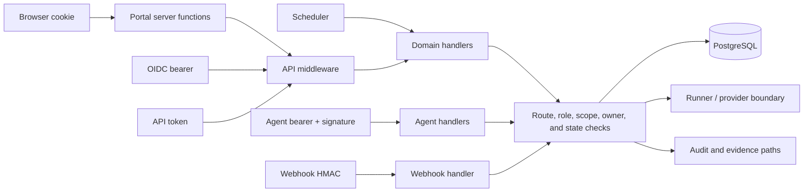
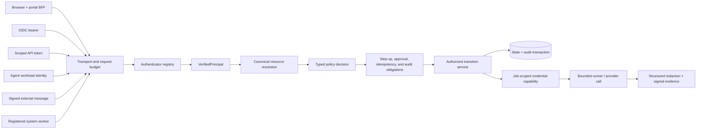

# Platform Security Boundary Specification

- Status: **proposed normative production boundary**
- Owner: platform and security engineering
- Evidence revision: `8212748308372e92d9cf794907d85fe103afd1da`
- Last updated: 2026-07-27
- Production gate: **blocking until the required invariants are implemented and verified**

This specification defines one security boundary for every Ryuki caller and
every privileged operation. It replaces the idea that browser sessions, bearer
tokens, agents, webhooks, schedulers, approvals, provider credentials, and audit
can each establish their own local trust rules. Existing documentation remains
useful for the details of those subsystems, but this page owns their shared
security invariants.

The target design is a local, typed security kernel with pluggable identity
providers and workload-identity backends. Every ingress path must normalize its
caller into the same principal context, obtain a policy decision for the final
resource identity, satisfy any step-up or approval obligations, and commit the
state transition with its audit record. A portal check, handler-local role test,
signed payload, or network location is never sufficient by itself.

## Decision

Ryuki will implement a **central admission and policy boundary with local
enforcement at privileged state transitions**.

- A single admission layer authenticates humans, API clients, agents, webhooks,
  and internal workers into one `VerifiedPrincipal` representation.
- The authenticator registry supports several configured identity providers at
  once. Microsoft Entra ID is one OpenID Provider configuration, not a hardcoded
  platform boundary.
- A typed authorization kernel decides an `Action` against a canonical
  `ResourceRef`, scopes, ownership, assurance level, and current lifecycle state.
- Handlers may add narrower checks, but cannot broaden the central decision.
- Approval and execution services re-check the decision after resolving the
  final resource and immediately before a privileged transition.
- Security-relevant state and its audit event commit in one database
  transaction. If authoritative audit cannot commit, the mutation fails.
- Provider credentials are capabilities issued for one approved job, not
  ambient process authority.
- Development identities remain available only in an explicitly local profile;
  they can never be selected by a production fallback.

### Enforceable security-kernel seam

**SB-BOUND-01 — Permit-bearing execution.** Every protected read, query, or
state transition follows this typed chain:

`CredentialEvidence -> VerifiedPrincipal -> ResolvedResource -> PolicyDecision -> AuthorizationPermit -> AuthorizedRepository/TransitionService`.

`AuthorizationPermit` has a private constructor owned by the authorization
kernel. A deny or an allow decision with unsatisfied obligations cannot create
one. Step-up, maker/checker, quorum, idempotency, and other obligations first
produce typed, current receipts bound to the decision; only the kernel can
verify those receipts and mint the permit. The permit binds the actor and
effective subject, canonical action, resource id and version, ownership and
site/environment scope, policy and authority versions, credential and provider
configuration versions, satisfied-obligation receipt digests, expiration, and
a transaction nonce.

A protected repository, query builder, or transition service accepts a current
permit. Collection reads use an unforgeable `QueryPermit` derived by the kernel
from that same satisfied decision; it binds the collection action, canonical
scope predicate, filter ceiling, policy/principal/credential versions,
expiration, and transaction or snapshot context. A raw SQL predicate, role
boolean, or caller-constructed filter is never an alternative authorization
credential. A handler cannot construct or widen either permit, reuse it after a
resource or authority-version change, or satisfy an obligation by assertion.
Resource resolution happens before the decision, and the final
resource/version is checked again in the same transaction as the mutation and
audit record.

**SB-BOUND-02 — Singular credential admission.** Admission classifies exactly
one primary credential profile before any verifier runs. Competing bearer,
cookie, session-header, API-token, client-certificate, or provider-hint carriers
are rejected. Proof such as DPoP, mTLS, or a session-bound CSRF token may be a
required component of one profile, but it is not a second fallback identity.
Once a verifier is selected, malformed, invalid, expired, revoked, or ambiguous
evidence is a final denial: Ryuki does not probe another verifier or fall
through to a weaker credential.

This is a target-state specification, not a claim that the current source
already conforms.

## Evidence basis and current limitations

A repository-wide deep static security review of the pinned revision produced
368 canonical candidates. Central validation sent 320 through attack-path
analysis; the strict attack-path aggregate classifies 232 as reportable (3
High, 169 Medium, and 60 Low), rejects 88 after calibration, and records 48 that
did not enter attack-path analysis. At this document revision the top-level
canonical `scan-manifest.json`, `findings.json`, `coverage.json`, and generated
report have not yet been finalized, so this specification does not describe the
aggregate as a completed or sealed canonical scan. These are source-level
results for the pinned revision, not claims about a rendered production
deployment. The requirements below treat repeated root controls as
platform-boundary work rather than asking each route or adapter to rediscover
the same invariant.

| Risk theme | Source areas inspected | Structural concern |
| --- | --- | --- |
| Configuration and development modes | `sources/ryuki-api/src/config.rs`, `sources/ryuki-core/src/config.rs`, deployment manifests | Invalid or incomplete production configuration must not select permissive development behavior. |
| Human authentication and sessions | `sources/ryuki-api/src/oidc_callback.rs`, `sources/ryuki-api/src/contracts.rs`, `portal/portal-ui/src/upstream.rs` | OIDC, local login, cookies, API sessions, logout, and administration currently own overlapping pieces of one session lifecycle. |
| Authorization and scoping | `sources/ryuki-api/src/main.rs`, `sources/ryuki-api/src/contracts.rs`, `sources/ryuki-engine/src/auth.rs` | Route gates, resource ownership, site/environment scope, approval authority, and audit are distributed across handlers. |
| Approval integrity | request, runbook, software, access-review, and live-execution paths | Actor, separation of duties, quorum, lifecycle version, plan, provider identity, and audit need one atomic decision boundary. |
| Machine and cryptographic identity | `sources/ryuki-api/src/agents.rs`, agent protocol and live grant paths | Bootstrap tokens, agent keys, control-plane signing keys, rotation, proof of possession, and revocation need one lifecycle. |
| External messages and evidence | `sources/ryuki-api/src/inbound_webhooks.rs`, `sources/ryuki-runner/src/scrub.rs`, `sources/ryuki-runner/src/live.rs` | A valid signature does not by itself provide freshness, replay protection, bounded processing, or complete secret handling. |
| Resource and supply-chain safety | scheduler, runner, CI, Docker, Compose, and Kubernetes files | Admission budgets, bounded work, immutable build inputs, and production-safe defaults are part of the same boundary's availability and integrity guarantees. |

Representative validated findings are traced to their required shared controls
below. Until canonical finalization, the strict attack-path aggregate and its
checksums are the per-instance policy source; after finalization, the generated
canonical report and finding records take over that role. This table prevents
the implementation program from reducing the work to a vendor or route
checklist.

| Validated finding family | Representative scan ids | Required boundary closure |
| --- | --- | --- |
| Cross-owner and cross-site authorization | `R01-MB-C015`, `R01-MB-C162`, `R01-MB-C164` | SB-BOUND-01, typed owner/site/environment resources, permit-bearing repositories, SB-2/SB-3 exit evidence. |
| Singular browser/API credential and CSRF admission | `R01-MB-C080`, `R01-MB-C211` | SB-BOUND-02, SB-AUTH-14, origin plus session-bound CSRF enforcement, conflict tests. |
| Credential-bearing endpoint and redirect safety | `R01-MB-C084`, `R01-MB-C091`, `R01-MB-C273`, `R01-MB-C336`, `R01-MB-C369` | SB-EGR-03, typed destinations, HTTPS production policy, redirect refusal, deadline and response bounds. |
| Session authority, expiry, revocation, and administration | `R01-MB-C210`, `R01-MB-C212`, `R01-MB-C213` | SB-SES-08, digest-only authentication ids, separate management ids, atomic fail-closed lifecycle. |
| Production configuration and development fallback | `R01-MB-C002`, `R01-MB-C259` | SB-CFG-01 through SB-CFG-04, explicit profile, loopback-only fixtures, no mock authority fallback. |
| Runner output, cancellation, and evidence redaction | `R01-MB-C005`, `R01-MB-C006`, `R01-MB-C008`, `R01-MB-C159`, `R01-MB-C205`, `R01-MB-C206`, `R01-MB-C364` | SB-EXEC-03/04 and SB-EXT-05 with process-tree cancellation, exact-vs-diagnostic capture modes, safe evidence projection. |
| Readiness and bounded background work | `R01-MB-C190`, `R01-MB-C363` | SB-OPS-07, SB-ING-03/04, cursor batches, single-flight probes, value-free public status. |
| CI event and artifact trust | `R01-MB-C077`, `R01-MB-C079`, `R01-MB-C245`, `R01-MB-C246` | SB-SC-01 through SB-SC-06, exact trusted revision, immutable inputs, provenance-bound promotion. |

The scan-start receipt for the pinned revision reported passing workspace tests,
formatting, Clippy, secret scanning, and patch checks. That revision-bound
receipt is useful baseline evidence, but neither it nor later unbound local
runs prove these cross-component invariants. Conformance requires accepted
evidence mapped to the acceptance cases in this specification.

## Scope and non-goals

The boundary applies to:

- browser and portal server-function requests;
- OIDC access tokens and browser authorization-code sessions;
- local emergency authentication;
- scoped API tokens and service clients;
- agents, control-plane grants, job results, and enrollment;
- inbound webhooks and future callbacks;
- schedulers, reconcilers, and other internal workers;
- administrative, approval, audit, and provider-execution operations;
- evidence, logs, exports, and security telemetry produced by those operations.

This specification does not enable live provider execution, choose production
tenants or identifiers, provision real credentials, or authorize changes in
Entra, Vault, PKI, DNS, or a provider. Those remain operator-owned deployment
decisions. It also does not require a remote policy service in the first
implementation.

## Pluggable authentication providers

Ryuki owns authentication *normalization*, not an identity directory. Human
identity providers plug into the admission layer and emit the same
`VerifiedPrincipal`; the rest of the platform must not branch on vendor names.

### Supported provider classes

| Provider class | Intended use | Boundary requirements |
| --- | --- | --- |
| Generic OpenID Connect | Primary browser and bearer authentication. Supports Entra ID, Keycloak, Okta, Auth0, Google Identity, Ping, Dex, Authentik, and other conforming providers through configuration rather than vendor-specific authorization code. | Discovery document and issuer are allowlisted; Authorization Code with PKCE; issuer/audience/nonce/expiry/key verification; logout and lifecycle capabilities are recorded per provider. |
| Brokered SAML or LDAP/AD | Organizations whose upstream directory does not present suitable OIDC directly. | Ryuki trusts an approved OIDC broker such as Keycloak; the broker owns SAML assertion or LDAP credential processing. Ryuki does not add a second native SAML/LDAP password boundary. |
| Local WebAuthn/passkey | Ordinary phishing-resistant authentication/step-up and a separately registered sealed emergency profile. | Exact RP/origin and purpose binding, recovery ceremony, short session, step-up, alerting, and recurring access review. Ordinary and break-glass credentials are never interchangeable; password-only local production access is prohibited. |
| OAuth service principal | CI and service-to-service clients whose IdP can issue audience-bound tokens. | Prefer `private_key_jwt`, mTLS-bound access tokens, or workload federation over shared client secrets; map to `service`, never `human`. |
| Scoped Ryuki API token | Compatibility for simple automation without a suitable OAuth issuer. | Digest-only storage, explicit audience/action/site/environment scope, short TTL, rotation, and no interactive or step-up authority. |
| Workload certificate or assertion | Agents and internal services. | mTLS/Vault PKI or SPIFFE/SPIRE identity, proof of possession, short lifetime, rotation, and trust-domain validation. |
| Development identity | Local demos and tests only. | Explicit development profile, loopback or isolated test network, synthetic principal label, and no production/live capability. |

### Versioned authenticator and credential-admission contract

**SB-IDL-01 — Authenticator registry.** A versioned `Authenticator` accepts
typed `CredentialEvidence`, an immutable provider configuration version, and a
bounded request context. It returns either a `VerifiedPrincipal` plus
authentication metadata or a typed denial; it never returns roles, an
authorization decision, or provider-specific session authority. An
`AuthenticatorRegistry` selects one implementation by the exact provider id,
configuration version, canonical issuer, and credential profile. Provider
selection is observable and auditable without logging credential material.

Every admitted implementation passes the same baseline suite for issuer and
audience binding, key and algorithm policy, expiry and replay, identity
namespacing, lifecycle revocation, conflicting credentials, error projection,
timeouts, and redirect handling. The release gate includes a standards-only,
non-Entra OIDC fixture so Entra-specific behavior cannot accidentally define
the generic contract.

**SB-AUTH-14 — Failure-final credential selection.** The credential admission
classifier implements SB-BOUND-02 for every carrier pair, duplicate header,
ambiguous token prefix, and provider hint. A verified composite profile such as
DPoP-bound OAuth or mTLS-bound OAuth is one configured profile; a failed bearer
or API token never falls through to a cookie or reusable session identifier.

### Implemented interactive-authority kernel

Migration 182 and the API authority repository implement the provider-neutral
authorization kernel used by the current Local and Entra carriers. The generic
OIDC handler is retained fail-closed but cannot launch until the registry binds
it to an exact D/P/Q/R runtime authority. The durable key is
`(provider, canonical issuer, provider subject)`;
vendor-specific tenant, object, email, or group fields are not schema keys.
The same key admits future brokered SAML/LDAP and passkey providers without
changing assignment or session semantics.

An assignment has a monotonic version and explicit `Unknown`, `Active`, or
`Revoked` state. Each site/environment axis separately has `Unknown`, `Global`,
`Scoped`, or `Revoked` authority. Global is valid only when written explicitly;
an empty Scoped set, Unknown, Revoked, missing assignment, invalid role, or
empty role/scope intersection denies admission. Verified carrier roles and
scope claims are an upper bound and are intersected with the server-owned role
allowlist and scope assignment. Local startup configuration uses the same
contract and refuses populated users until both axes explicitly select Global
or nonempty Scoped authority.

Browser sessions capture the exact identity epoch, assignment version,
effective roles, and effective axis modes/scopes in one transaction. Database
triggers and an exact per-identity writer order lock identity before assignment,
reject epoch rewind/jump and future/revoked session generations, delete sessions
and invalidate derived API tokens atomically with authority changes, preserve
identity/assignment/token tombstones, and require canonical bounded arrays.
Session credentials are immutable after issuance. Derived API-token evidence
binds the exact human identity epoch and assignment version, actor subject,
role ceiling, and both authority axes; it expires within 24 hours, cannot mint
or administer credentials, and cannot acquire interactive-human authority.

Direct Entra bearer traffic performs the same identity/assignment transaction
on every request only after the signed claims establish a delegated user actor.
`idtyp=app`, scope-less client/application claims, and ambiguous actor kind map
to Workload or Unknown and fail the human boundary. Positive lookup-cache
entries retain only a one-way authority fingerprint, active version/status,
and axis provenance; they remain admission hints and never replace the database
join. Platform settings, agent enrollment, emergency operations, credential
inventory, and credential revocation require a Global VerifiedHuman at both
the central admission boundary and their handler sink.

The governed-assignment writer and provider lifecycle kernel remain test-only.
Production activation is unavailable until a trusted integration adds
authenticated event ordering, maker/checker review, bounded grant expiry, and
an audit/outbox record in the same transaction. Live IdP user-token claim
conventions and assignment population/readback remain explicit acceptance
evidence rather than repository assumptions.

This is an explicit non-overlap compatibility cutover, not an SB-EVO-03
expand/migrate/contract claim. Pre-182 replicas must be stopped before migration
182 because their direct-bearer path cannot be database-fenced. The checked-in
API deployment uses `Recreate`, and the migration invalidates all existing
interactive sessions. Rollback is coupled: stop every reader, invalidate every
interactive credential generation, and restore database plus binary together.
Restoring only an old schema/data snapshot is prohibited because it can
resurrect ambiguous pre-cutover authority. Multi-replica rollout/recovery
evidence and live IdP assignment claim/group/readback remain trusted-access
acceptance work. See the
[interactive human authority cutover runbook](../runbooks/interactive-human-authority-cutover.md).

### Multi-provider rules

- A deployment may configure multiple OIDC issuers. Every provider has a stable
  `provider_id` and immutable configuration versions. A provider version has
  common fields for kind, trust domain, lifecycle state, allowed deployment
  profiles, destination policy, credential reference, capability-descriptor
  version, and audit owner; kind-specific fields add issuer/client, relying-
  party, broker, or workload settings.
- Browser login selects an explicit provider id and binds it into state, nonce,
  PKCE, callback, provider configuration version, and session metadata. A
  callback cannot switch providers or configuration versions.
- A bearer token's unverified issuer may be read only to choose an already
  allowlisted verifier. Ryuki never fetches discovery or keys from a URL supplied
  by an untrusted token, and accepts the token only after exact verification.
- **SB-AUTH-15 — Unique verifier resolution.** The tuple `(provider_id,
  config_version, canonical_issuer, token_profile)` selects exactly one verifier
  or denies admission. Discovery, JWKS, introspection, nonce, replay, and key
  caches are partitioned by that tuple. A `kid`, subject, email, client id, or
  audience collision across issuers cannot select a key, account, cache entry,
  or authority from another provider.
- External identity is namespaced by `PrincipalKey(provider_id, canonical
  issuer, provider subject)` and maps to a stable internal `principal_id`.
  Email address or display name never creates or links that mapping. Linking
  and unlinking follow an explicit, stepped-up, audited state machine with
  proof of both identities or maker/checker recovery.
- Claim-to-role and claim-to-scope mappings are allowlisted and schema-checked.
  Unknown claims or roles grant nothing. External assertions and platform grants
  are intersected when both constrain authority.
- Each provider declares support for back-channel logout, token revocation,
  SCIM/lifecycle provisioning, Shared Signals/CAEP or RISC security events,
  group or role claims, and step-up assurance. All lifecycle signals normalize
  into the same idempotent versioned revocation stream; unsupported event types
  never imply healthy revocation coverage.
- A policy may require a high-assurance OAuth profile for privileged clients.
  When enabled, the provider/client contract implements the final FAPI 2.0
  Security Profile—including sender-constrained tokens and pushed authorization
  requests—as one conformance-tested capability, rather than selecting isolated
  options while claiming profile compliance. The policy engine refuses a
  provider that lacks any required authentication, lifecycle, or assurance
  capability for the action.
- Direct native SAML, LDAP bind, social-login, or vendor Graph API logic stays
  outside the core boundary unless a later design review shows that brokering
  through OIDC cannot satisfy a documented requirement.

### Brokered enterprise identity boundary

For SAML, LDAP, Active Directory, or another enterprise directory, the approved
broker terminates the upstream protocol and issues an ordinary configured OIDC
identity to Ryuki. SAML assertions, LDAP passwords or bind credentials,
upstream cookies, upstream refresh tokens, and directory service credentials do
not cross into Ryuki. Directory-derived attributes carry provider/configuration
provenance and may feed an allowlisted mapping; they are never direct account-
link keys, proof of current directory membership, or authorization by
themselves.

### Provider configuration and lifecycle

Every provider configuration version has an immutable payload with these common
fields: `provider_id`, `kind`, `config_version`, `trust_domain`, allowed
deployment profiles, typed outbound destinations, a `SecretRef` for any client
credential, claim/assurance or credential-policy references, a capability
descriptor version, and ownership/audit metadata. Its separately persisted
provider lifecycle record references `provider_id` plus `config_version` and
owns lifecycle-record version, state, effective time, transition receipt, and
supersession. Lifecycle is never edited into the immutable configuration or
capability descriptor. Kind-specific configuration fields are closed schemas:

| Kind | Required kind-specific configuration |
| --- | --- |
| `oidc` or `oidc-broker` | Canonical issuer, discovery/JWKS and authorization/token endpoints, JWT/JWKS or authenticated-introspection validation mode, client id and authentication method, accepted audiences/algorithms, redirect/logout URIs, claim and assurance mappings, and lifecycle/logout/revocation modes. |
| `local-webauthn` | Relying-party id, allowed origins, attestation/authenticator policy, emergency-only policy, recovery ceremony, and session/step-up limits. |
| `oauth-service` | Issuer, token or introspection endpoint, client authentication method, audience, sender constraint, and claim-to-service mapping. |
| `api-token` | Issuance policy, permitted purposes/audiences/actions/scopes, registered limit-profile ids for TTL/overlap, and deprovision owner. |
| `workload` | Trust domain, certificate/assertion profile, trust bundle, proof-of-possession method, rotation, and revocation source. |

The lifecycle record for a configuration version normally moves
`configured -> validated -> active -> draining -> removed`. `configured` and
`validated` accept no authentication; activation is an approved atomic
transition. `draining` issues
no new sessions, tokens, links, or grants and permits existing authority only
for its recorded bounded lifetime. `removed` is terminal and retains a non-
reusable tombstone. As an exceptional transition, any non-removed version may
enter `quarantined`; quarantine immediately denies new authority and applies its
configured revocation response. A quarantined version can move only to
`removed`; service recovery activates a new validated configuration version—
never fallback or automatic unquarantine.

### OIDC custody and normalized lifecycle

Ryuki's server-side admission component owns authorization-code exchange and
custody of codes, access tokens, and refresh tokens. They are never exposed to
portal JavaScript, browser storage, URLs, logs, or administrative APIs. An ID
token may establish the browser authentication event after complete validation,
but it is not an API bearer credential; APIs accept a correctly audience-bound
access token or an opaque Ryuki session only.

Refresh tokens belong to a server-side family and rotate on every successful
use. Reuse of a retired member is a family-compromise event that revokes the
family and derived sessions, records a stable reason, and requires fresh
authentication. Provider logout, signed OIDC back-channel logout, lifecycle
provisioning, token introspection where configured, local logout, and
administrative revocation normalize into versioned session/principal lifecycle
events. Each event binds provider id/configuration, issuer, subject or session,
event id, issued time, source watermark, and resulting authority version.
Production policy defines and monitors maximum propagation/revocation lag;
stale or unordered events cannot restore authority.

### OAuth client profiles and grant types

**SB-AUTH-16 — Explicit OAuth profiles.** Each registered client selects one
closed profile and may use only its grants, redirect forms, authentication
method, custody model, and maximum authority:

- **BFF/web:** Authorization Code, PKCE `S256`, exact redirect URI, state and
  nonce, and server-side code/token/refresh custody.
- **Native/public:** RFC 8252 external user agent, PKCE `S256`, and an exact
  claimed HTTPS, private-use, or loopback redirect appropriate to the client;
  embedded browsers and client secrets in a public binary are prohibited.
- **Device:** RFC 8628 for registered clients, short and replay-safe device/user
  codes, bounded polling with `slow_down`, and a user-visible client and scope
  confirmation. Device flow cannot satisfy step-up, owner recovery, break-glass,
  or live-execution approval.
- **Service:** client credentials with `private_key_jwt`, mTLS, or workload
  federation where supported. A shared credential is referenced only by
  `SecretRef`; private-key operations use `KeyCustodian` and do not export the
  key.

Wildcard redirects, PKCE `plain`, implicit or hybrid grants, and the resource-
owner password grant are prohibited. Authorization, token, discovery, JWKS,
introspection, and logout destinations are typed configuration: remote
credential-bearing calls require HTTPS, do not follow redirects, and use
bounded deadlines and responses.

### Ordinary passkeys and break-glass WebAuthn

**SB-AUTH-17 — Separate WebAuthn purposes.** `local-passkey` provides ordinary
authentication or step-up for an eligible account. `break-glass-passkey` only
proves eligibility to enter the separate time-bounded maker/checker emergency
activation ceremony. A credential cannot be registered for, discovered by, or
accepted across those purposes.

Both profiles enforce the exact RP ID and origin, one-time expiring challenges,
user verification, credential lifecycle revocation, last-credential and
recovery protections, and an explicit policy for backup-eligible, backed-up,
and clone/counter signals. There is no password fallback. A passkey used at an
upstream identity provider is recorded only as an OIDC assurance signal; Ryuki
does not treat it as a locally managed credential.

### Configuration shape

The target configuration is a provider registry rather than one global
`RYUKI_AUTH_MODE` switch. YAML, TOML, environment, database, and administrative
API projections may differ, but they must round-trip one published, versioned
registry schema without losing security semantics. The schema and its migration
fixtures are part of the boundary contract, not an undocumented implementation
detail. It must model the equivalent of:

```yaml
schema_version: 1
deployment_profile_version: 1
deployment_id: <deployment-id>
security_profile: production
platform_configuration_version: 1
policy_version: 1
provider_registry_version: 1
tenancy_mode: single_tenant
trust_topology:
  trust_domains: [corporate]
security_limit_profile_version: 4
control_plane_topology: single-region-single-writer
egress_policy_version: 1
retention_policy_version: 1
authentication:
  default_provider: corporate-oidc
  providers:
    - id: corporate-oidc
      kind: oidc
      config_version: 1
      trust_domain: corporate
      allowed_profiles: [production]
      required_for_profiles: [production]
      capability_descriptor_version: 1
      issuer: https://idp.example.test/issuer
      client_id: ryuki-platform
      audience: ryuki-api
      role_mapping: app-roles
      destination_policy: corporate-identity-egress
    - id: emergency-passkey
      kind: local-webauthn
      config_version: 1
      trust_domain: corporate
      allowed_profiles: [production]
      capability_descriptor_version: 1
      emergency_only: true
  provider_lifecycle:
    - provider_id: corporate-oidc
      config_version: 1
      lifecycle_record_version: 3
      state: active
      transition_receipt_digest: <value-free-digest>
    - provider_id: emergency-passkey
      config_version: 1
      lifecycle_record_version: 2
      state: active
      transition_receipt_digest: <value-free-digest>
```

Values above are documentation placeholders. Real issuer, tenant, client,
object, and credential values are deployment data and must not be committed.

The document above is the executable deployment-security-profile root; its
authentication section is one referenced provider registry projection.

**SB-IDL-02 — Executable provider registry.** The implementation publishes a
machine-readable schema for the registry, closed immutable kind-specific
configuration payloads, separately versioned lifecycle records, capability
descriptors, profile/applicability rules, typed destinations, credential
references, and claim or assurance mappings. Parse, schema, reference,
uniqueness, lifecycle, and required-capability errors are fatal before a
production listener binds.

The legacy `RYUKI_AUTH_MODE` switch and a provider registry cannot both select
authority: configuring both is a startup error unless an explicit,
time-bounded `migration_overlay` is bound to exactly one of the three deployment
profiles. The overlay is not a fourth profile and grants no authority; it names
one source of truth, emits conflict telemetry, cannot enable live execution,
and has a retirement deadline and zero-consumer receipt.

Implementation conformance and deployment conformance are distinct. Every
shipped adapter kind must pass its mandatory kind baseline. A production
deployment must activate at least one non-development human authenticator and
every authenticator, workload identity, secret, key, certificate, or lifecycle
capability required by its enabled features and policy. An optional provider
that is neither configured nor advertised does not block that deployment; once
configured or advertised, its exact version and every claimed capability enter
the non-skippable control set. Development providers are never applicable to a
production profile.

## Pluggable secret-management providers

Secret storage, credential issuance, key custody, and certificate issuance use
narrow capability interfaces. Provider selection must not leak into domain
handlers, job specs, or evidence. A serializable `SecretRef` contains only a
configured provider instance and opaque selection metadata; it never contains
secret material.

### Backend classes

| Backend class | Initial adapters | Appropriate use |
| --- | --- | --- |
| Lease-capable secret service | HashiCorp Vault and OpenBao, implemented as separately tested adapters over shared protocol code where safe | Versioned KV, dynamic database/cloud credentials, response wrapping, PKI, signing, lease renewal, and revocation. Capability detection is explicit; OpenBao is not assumed byte-for-byte compatible for every engine or release. |
| Cloud secret manager | Azure Key Vault, AWS Secrets Manager, Google Secret Manager | Versioned static secrets and provider-native rotation, authenticated with managed/workload identity and least-privilege IAM/RBAC rather than stored cloud access keys. |
| Deployment injection | Secrets Store CSI Driver and External Secrets Operator | Materialize an externally managed secret as a rotated file or mounted volume for components that cannot call a manager. This is an injection mechanism, not proof of per-job lease or revocation support. Production secrets must not be injected into general environment variables. |
| Enterprise/plugin adapter | CyberArk, 1Password Connect, Bitwarden Secrets Manager, or another approved product | Added through the same capability contract when an operator requirement and conformance test suite exist; no domain-specific shortcuts. |
| Development adapter | In-memory fixture or permissions-checked local file | Tests and isolated development only. It is rejected by the production profile and cannot satisfy live-execution readiness. |

### Secret data and capability contracts

The administrative `SecretReferenceRecord` is a governed, serializable,
value-free record that owns reference id, owner, consumer, approval, rotation
policy, and readiness. It is not the runtime handle and cannot be passed to a
resolver. An admitted activation projects its immutable security fields into a
runtime `SecretRef`; runtime lease state never mutates the governance record by
implication.

The canonical runtime material boundary has three distinct types:

- `SecretRef` is serializable and contains schema version, provider id and
  configuration version, deployment id, trust-domain id, optional tenant id,
  opaque locator and field selector, purpose, reference fingerprint and
  fingerprint key id, and `Pinned(secret_version)` or `LatestAtResolve`. Its
  canonical fingerprint uses a dedicated versioned keyed-hash keyring, so audit
  can retain correlation across controlled key overlap without revealing a
  sensitive path.
- `SecretLeaseMetadata` is serializable and contains the reference fingerprint,
  fingerprint key id, resolved secret version, provider/adapter capability
  versions, workload, deployment id, trust-domain id, optional tenant id,
  purpose, request/job, lifecycle state, authority epoch, fencing token, and
  lifecycle-conditional lease id, resolved version, issuance, expiry, and
  terminal times. `requested` metadata cannot fabricate fields
  that exist only after issuance; active-family states require exact version
  and expiry metadata. It contains no value.
- `SecretMaterial` is a non-serializable, non-debuggable, scope-bound zeroizing
  byte container. It is never placed in general caches, messages, evidence,
  errors, or administrative projections.

Adapters implement only the narrow interfaces they actually support:
`SecretResolver`, `DynamicCredentialIssuer`, `LeaseController`,
`KeyCustodian`, and `CertificateIssuer`. There is no single trait whose optional
methods can turn unsupported behavior into runtime surprises. A provider's
versioned capability descriptor binds adapter artifact/version, protocol
version, provider configuration version, implemented interface semantic
versions, limitations, and conformance-evidence digest. At minimum every
production secret resolver must prove workload authentication, version-aware
resolution, value-free health/error behavior, redaction/zeroization, and audit;
policy may require stronger interface-specific baselines.

The current control-plane compatibility seam now depends on a provider-neutral
`SecretResolver` trait and selects the HashiCorp Vault KV-v2 adapter only when
`secret_provider=hashicorp-vault`. Its process configuration is all-or-none,
requires HTTPS outside an explicit IP-literal loopback test exception, disables
ambient proxies and redirects, and never falls through to another provider or
the development adapter outside dual static/mock dry-run admission. This closes
the immediate bearer-transport and fallback boundary; it does **not** claim the
target `SecretRef`, provider configuration registry, workload identity,
version/lease metadata, agent-side resolution, or production conformance.

The publication-separation rule formalized as **SB-SEC-09** below keeps
`SecretVersionPublisher` distinct from `SecretResolver`. Publication requires a
purpose-bound permit, expected source and destination versions,
compare-and-set semantics, idempotency, zeroization, and a metadata-only
receipt. A resolver-only adapter cannot write, copy, or claim rotation by
rereading the same value. A provider that supports both capabilities implements
and proves them independently.

The materialization rule formalized as **SB-SEC-10** below models CSI, External
Secrets Operator, Vault Secrets Operator, and file delivery through a
`MaterializationController`, not as lease-aware resolvers. The controller
accepts a `SecretRef` and typed destination, exposes only version/freshness
metadata, and enforces destination namespace and workload identity, read-only
ownership and mode, atomic replacement, bounded staleness, consumer
acknowledgement, rollback, revocation, and deletion. A Kubernetes `Secret` or
mounted file starts a new custody and retention boundary; it is not proof of
dynamic issuance, wrapping, renewal, or source revocation. General
environment-variable delivery is prohibited in the production target state.

The continuously reconciled VSO skeleton has exactly three materializer
ServiceAccount/VaultAuth families: database owner, database backup, and the
runtime API database lease. Owner and backup delivery are static; the API
database credential is a revoking `VaultDynamicSecret`. The Deployment imports
only its exact `RYUKI_DATABASE_URL` key through `secretKeyRef` and uses a
non-overlapping `Recreate` restart. A fourth, digest-scoped migrator
ServiceAccount/VaultAuth and revoking `VaultDynamicSecret` exist only in the
operations template: they are created after all writers drain and deleted after
independent role/ledger readback, before the matching API starts. Short
control-plane downtime is accepted so an old authentication or secret-bearing
process cannot overlap its replacement. Effective external Vault policies,
TokenRequest authority, rendered CRD support, authenticated transport,
rotation delivery, and old-credential revocation timing remain deployment
conformance evidence; the manifests alone prove none of them.

The Kubernetes base also makes image mutability fail closed: API and portal
use non-resolving, fully qualified digest-only placeholders, and the manifest
validator admits an image value only in
`registry/repository@sha256:<64 lowercase hex>` form. The same validator is a
post-render gate, so an overlay or GitOps rewrite cannot replace the digest
with a tag-only or unqualified reference without failing. These placeholders
do not prove an adopted registry, signature, provenance record, or running
image ID; those remain production conformance evidence. Local Compose
`ryuki/*:rust-dev` build tags are intentionally outside this Kubernetes
contract.

Capabilities include, as separately versioned semantics rather than booleans:

- versioned KV read and metadata;
- dynamic issuance, lease expiry, renewal, and revocation;
- one-time or response-wrapped delivery;
- certificate issuance and workload authentication;
- signing or encryption without exporting a private key;
- rotation/watch notification;
- health and readiness without returning secret material.

Policy can require capabilities. For example, a production database may require
a renewable dynamic credential, while a vendor integration may temporarily use
a versioned static secret. A backend that only supports static reads must not
emulate a renewable lease or silently serve stale data. A capability cannot be
enabled merely by advertising it: its current descriptor and conformance record
must pass. Baseline or policy-required tests cannot be marked skipped by
removing the capability from the descriptor, and descriptor regression or
downgrade quarantines the provider version.

Resolution returns `SecretMaterial` and `SecretLeaseMetadata` across a
scope-bound interface. A lease moves through `requested`, `issued`, `active`,
`renewing`, `draining`, and one terminal state of `revoked`, `expired`, or
`failed`. Renewal and revocation compare the current authority epoch and fencing
token before changing state. Cache keys include provider/configuration,
reference fingerprint, resolution mode, deployment id, trust-domain id,
optional tenant id, purpose, resolved
version, and authority epoch; cache lifetime never exceeds provider lease or
version freshness. A watch notification is only a hint to re-resolve and cannot
itself authorize a version. Rotation activates a verified replacement before a
bounded drain of the prior lease, and uncertain failover enters reconciliation
rather than renewal or re-issuance.

Keys additionally declare one portability class: `exportable_encrypted`,
`provider_wrapped_recoverable`, or `non_exportable_provider_bound`. A
non-exportable key is used only through `KeyCustodian`, and provider removal is
blocked until dependent signatures, ciphertext, grants, and certificates have
been verified under a dual-read/dual-verify migration or reissued/re-encrypted
under a replacement. The platform never relabels key generation as key
migration.

### Control-plane and execution-plane ownership

- Control-plane integrations may resolve a handle in process only for the
  immediate approved outbound call. The value is not persisted or returned.
- Live provider credentials should resolve on the assigned agent using that
  agent's workload identity. When central brokerage is unavoidable, delivery is
  one-time, encrypted to the agent, job-bound, and short-lived; the control plane
  retains only lease metadata.
- Every secret-manager adapter authenticates with workload identity where the
  provider supports it: Kubernetes/Vault auth, managed identity, AWS workload
  roles, Google Workload Identity Federation, or SPIFFE federation. Static root
  tokens and cloud access keys are bootstrap exceptions with explicit expiry,
  not normal runtime configuration.
- Secret access audit records include actor, workload, provider instance,
  provider/adapter versions, reference fingerprint, purpose, job/request,
  capability, authority epoch, fencing token, version/lease id, and normalized
  outcome—never path fields that are themselves sensitive or any value. Adapter
  failures map to a closed code such as `not_found`, `denied`, `throttled`,
  `unavailable`, `integrity_failure`, `stale`, or `unsupported`; raw provider
  text is restricted diagnostic data and never a metric label or client error.
- Rotation is provider-aware. Ryuki reacts to a new version or lease and drains
  the old credential within a bounded overlap; it does not invent rotation by
  repeatedly reading an unchanged static value.

## Boundary lifecycle and operational controls

Supporting more identity and secret providers increases flexibility, but also
creates new downgrade, confusion, plugin, and recovery paths. The following
controls are part of the boundary rather than optional operational guidance.

### Bootstrap and privileged administration

- The first platform owner is established by a deployment-bound, one-time
  bootstrap capability. The claim is concurrent-safe, replay-safe, expires,
  and closes permanently after use; an empty or restored database does not
  reopen it automatically.
- Ownership transfer, last-owner removal, and recovery from owner lockout are
  separate stepped-up, maker/checker operations with explicit recovery
  evidence. An ordinary role or external group cannot become the first owner
  merely by presenting a matching name or claim.
- Identity-provider administration, authorization-policy administration,
  secret/key custody, audit administration, and live-execution administration
  are separate privileged domains. A deployment may combine roles only through
  a documented risk acceptance; routine `admin` must not implicitly satisfy
  every domain.
- Break-glass identity is provisioned dormant: its public route and authority
  remain disabled until a time-bounded, stepped-up maker/checker activation
  records the incident and maximum authority. WebAuthn stores the credential id,
  authenticator public key, counter, and policy metadata; it does not hash the
  public key as though it were a password. Only a separate high-entropy fallback
  recovery secret, if policy permits one, is stored as a salted versioned
  Argon2id digest.

### Security contract and protocol evolution

- `VerifiedPrincipal`, actions/resources/decisions, sessions, grants, agent
  messages, secret references/leases, callbacks, audit, evidence, and adapter
  APIs use typed versioned envelopes with a canonical signed representation
  where integrity depends on bytes.
- Unknown critical fields or security semantics fail closed. Compatibility
  negotiation is allowlisted and authenticated; neither side may silently
  downgrade identity assurance, policy version, signature coverage, replay
  behavior, secret capability, or execution constraints.
- Every contract has an owner, supported N/N-1 compatibility window, rollout
  order, migration fixture, deprecation deadline, and retirement test. Mixed
  binary/schema rollouts are safe by construction rather than depending on
  simultaneous deployment.

### High availability, failover, and time authority

- A deployment declares its control-plane topology. Multi-region active/active
  privileged mutation is prohibited until a reviewed design provides one
  monotonic authority epoch, single-writer ownership, strongly consistent
  replay/idempotency/approval state, and stale-region grant refusal.
- Scheduler leadership, signing authority, agent leases, approvals, provider
  calls, and failover transitions carry the authority epoch. A fenced or old
  primary cannot mint new work, consume approvals, accept results, or rejoin as
  writer without an explicit reconciliation ceremony.
- The repository implementation now provides the local site-health portion of
  that fence: every `LiveApply`/`LiveDestroy` grant stores the exact epoch of an
  active, fresh `healthy/up/up` site plus fresh VMware observation, and the
  database rechecks it at persistence, lease, acknowledgement, renewal, and
  first result acceptance. A lost epoch retains signed result evidence but
  forces reconciliation. This is deliberately not yet the distributed
  control-plane epoch above; signing that authority into the agent protocol and
  proving multi-replica failover remain SB-3/SB-8 work.
- An uncertain provider call is never blindly retried after leader or region
  loss. It enters a provider-specific reconciliation state that proves outcome
  before any compensation or redispatch.
- Time synchronization is a security dependency whose maximum tolerated skew
  is a registered security-limit id, with independent monitoring and a tested
  recovery path. Wall-clock rollback must
  not revive expired credentials, grants, leases, replay windows, or step-up.

### Production PostgreSQL migration and serving boundary

- Production schema changes use an isolated `apply-only` process and one
  explicit migration credential. The normal serving pool cannot perform DDL,
  and the migration process never starts listeners, workers, or application
  routing.
- PostgreSQL infrastructure attestation protocol v2 carries an explicit
  `migration` or `application-serving` session purpose. It binds that purpose
  with the one-shot nonce into the TLS 1.3 exporter context, request tag,
  canonical request, and signed response, so a valid migration proof cannot be
  substituted for a serving session or vice versa.
- The deployment receipt binds a direct PostgreSQL provider route consisting of
  provider, canonical DNS name and port, exclusive CA-bundle digest, and exact
  peer leaf-certificate digest. The runner establishes TLS 1.3 itself, checks
  that route before releasing credentials, permits only SCRAM-SHA-256 startup
  authentication, disables TLS resumption, derives an exporter-bound request
  tag, and exposes the measured stream to exactly one SQLx connection through
  a bounded loopback relay whose listener remains bound to that runtime.
- An independently governed PostgreSQL infrastructure authority must derive the
  same purpose-bound TLS exporter at the database endpoint and sign the exact
  provider, cluster, durable-storage, database, role, migration-inventory, and
  backend-session projection. The authority/profile pins supplied by the
  deployment and the receipt-bound profile, route, identities, roles, and
  session must remain in exact lockstep. A client-echoed tag or local SQL
  observation is not independent evidence.
- For `application-serving`, startup retains the exact measured TLS channel,
  bound loopback relay listener, application-role backend session, durable local
  observation, and SQLx pool as one non-cloneable runtime. Production requires
  configured `max_connections=min_connections=1`; immediately after the first
  connection, SQLx's stored options are replaced with a passwordless,
  locally non-connectable sentinel while the original listener stays bound, so
  SQLx has no credential-bearing reconnect, wider-pool, or fallback path.
  The retained allocation is remeasured at startup fences and remains
  unpublished until the complete eight-guard admission authorizes publication.
- Serialization is acquired on the backend before `BEGIN`, promoted to the
  same transaction-scoped advisory lock as the first transactional statement,
  and then removed from session scope. Migration SQL cannot release the
  transaction fence. Parser settings, backend PID, transaction identity,
  isolation, and writability are pinned and rechecked around every raw
  migration.
- Pending DDL, privilege reconciliation, exact ledger verification, and a
  deterministic append-only operation marker commit atomically. A timeout or
  transport loss after `COMMIT` dispatch is `CommitOutcomeUnknown`; only a new
  independently attested run may reconcile the exact marker and final
  inventory. It must never assume rollback or blindly replay DDL.
- The checked-in Kubernetes validator currently authenticates only an offline
  snapshot. It cannot atomically consume an attempt, prevent ConfigMap
  deletion/recreation before Pod materialization, or enforce receipt freshness
  in the running process. Consequently production `apply-only` remains
  fail-closed before the database credential is read. Re-enabling it requires a
  live admission authority plus a non-cloneable runtime receipt capability that
  binds the materialized pins and constrains DDL and commit by its expiry.

### Adapter trust and conformance

- First-party adapters are compiled, version-pinned parts of the trusted
  computing base. They do not load arbitrary shared libraries or execute a
  provider CLI from `PATH` inside the API process.
- A statically linked adapter may be classified as first-party only when its
  source, build, release, and support lifecycle are owned and reviewed with the
  platform. A dynamically replaceable or third-party component is a plugin and
  always runs out of process; review does not turn a plugin into in-process
  trusted code.
- **SB-EXT-04 — Plugin containment.** Every plugin uses a versioned mutually
  authenticated protocol and workload identity, an explicit provider-specific
  capability grant, deny-by-default filesystem and network access, no ambient
  credentials, bounded CPU/memory/process/output/concurrency budgets, and an
  operator kill/quarantine switch. A plugin cannot load code or execute a CLI
  inside the API or runner process.
- **SB-EXT-05 — Bounded external operations.** Every adapter call receives an
  end-to-end deadline and cancellation token, declares the single retry and
  idempotency owner, bounds request and response bytes, and maps timeout or lost
  acknowledgement to an uncertain-outcome reconciliation state. Dropping an
  HTTP request future does not authorize a subprocess or provider mutation to
  continue unowned.
- Every authentication and secret-manager adapter passes a common conformance
  suite plus provider-specific negative tests. A capability is enabled only
  when the admitted adapter/version proves it. The suite has mandatory
  per-kind baselines; an adapter cannot avoid a failing required test by
  deleting, renaming, or downgrading an advertised capability.
- Adapter packages, images, and plugins are pinned, signed or provenance-bound,
  included in the release SBOM, and subject to an explicit support and
  deprecation policy.
- A provider error never triggers automatic fallback to another IdP, secret
  store, local credential, development identity, stale cache, or newly generated
  key. Fallback changes identity or authority and therefore requires an explicit
  stepped-up, audited configuration transition.

### Outbound network and destination trust

- All OIDC, JWKS, SCIM, secret-manager, webhook, callback, registry, provider,
  and backend destinations are typed configuration owned by an administrator or
  approved resource—not arbitrary URLs accepted by a low-trust request.
- Destination validation covers scheme, user-info prohibition, host, port,
  path, redirects, proxy policy, DNS resolution, IP class, and TLS identity.
  Each redirect is re-evaluated, and DNS rebinding cannot move an allowed name
  to a forbidden address after policy approval.
- **SB-EGR-03 — Credential-safe redirect policy.** Credential-bearing clients
  do not follow redirects by default. An explicitly supported redirect creates
  a new typed destination decision and never forwards `Authorization`, cookies,
  client assertions or secrets, query credentials, or client-certificate
  authority to the new request. A scheme, origin, proxy, or trust-root change
  requires fresh policy evaluation; HTTPS-to-HTTP downgrade is always denied.
- Production egress starts deny-all. Every adapter declares its required
  destinations and protocols; unexpected egress is blocked and observable.
- TLS verification is mandatory outside isolated tests. Trust stores,
  certificate pins where used, client certificates, proxy roots, and rotation
  ownership are explicit deployment data.

### Data classification, tenancy, and retention

- Data is classified as `public`, `internal`, `sensitive`, `restricted`, or
  `secret`. Every API model, database column, event, evidence field, log field,
  metric label, cache, export, and backup has an owner and classification.
- Secrets and reusable credentials never enter general platform state. Restricted
  identity, provider, infrastructure, and audit data is minimized and encrypted
  in transit and at rest with documented key ownership and backup behavior.
- Site and environment scoping are authorization constraints, not proof of
  tenant isolation. Every installation declares orthogonal `tenancy_mode`
  (`single_tenant` or `multi_tenant`) and `trust_topology` (one or more named
  trust domains), plus a stable `deployment_id`. The multi-tenant profile is
  rejected until `tenant_id` is present in principals, resource/storage keys,
  caches, replay/idempotency keys, queues, quotas, audit, exports, backups,
  secret references, and provider credentials, with database row-level or
  service-level isolation as defense in depth. `trust_domain_id` remains an
  identity/cryptographic trust property and cannot substitute for `tenant_id`.
- A retention matrix defines lifecycle semantics, deletion or cryptographic-
  erasure behavior, legal-hold precedence, archive destination, and restore
  behavior for sessions, tokens, replay ids, approvals, audit, evidence, jobs,
  notifications, caches, and backups. Every minimum/maximum lifetime references
  a registered security-limit id; the matrix does not copy its numeric value.
- Privacy erasure does not rewrite authoritative audit facts. Subject-facing
  export, correction, restriction, and deletion use documented pseudonymous
  tombstones or crypto-erasure, preserve only the minimum legally required
  evidence, record legal-hold precedence, and reapply erasure after backup
  restore before ordinary access resumes.
- The executable-retention rule formalized as **SB-DATA-05** below requires a
  versioned controller to own legal-hold evaluation, bounded deletion work,
  cryptographic erasure and tombstones, retries, quarantine, restore-time
  reapplication, and metadata-only deletion receipts. Narrative policy or a
  one-shot cleanup job cannot satisfy retention readiness.
- Logs and metrics never use subject ids, secret references, request bodies, or
  other sensitive/high-cardinality values as unbounded labels.

### Degraded-mode matrix

Every security dependency has a documented failure mode. At minimum:

| Dependency failure | Required behavior |
| --- | --- |
| Identity provider or JWKS unavailable | Existing verified sessions may continue only within their recorded expiry and policy; new login and required step-up fail. Ryuki does not try another provider automatically. |
| Lifecycle/SCIM unavailable | New privilege grants stop or are time-bounded according to policy; revocation lag becomes unhealthy and alerts. High-risk actions may require a fresh lifecycle check. |
| Secret manager unavailable | New resolution, renewal, and live work fail unless an existing lease is still valid and policy explicitly permits its use. Expired or unverifiable material is never served stale. |
| Policy evaluation error | Deny the operation and emit a value-free diagnostic. No cached allow survives a resource, policy, principal, or credential version change. |
| PostgreSQL unavailable | Production security mutations, sessions, replay recording, approvals, and audit fail. Health/readiness remains value-free; no in-memory privileged substitute activates. |
| Audit or outbox unavailable | The associated authoritative mutation fails in the same transaction. |
| Clock skew exceeds policy | Token, grant, replay-window, lease, and step-up-sensitive operations fail until time is trustworthy. |
| Workload trust or signing key unavailable | New agent work, grant minting, and result acceptance fail; existing work enters an explicit reconciliation state rather than being redispatched. |

### Policy and configuration governance

- Authentication providers, claim mappings, secret stores, trust roots, egress
  rules, role/scope policy, and production profiles are versioned security
  configuration. Read and change authority are separate actions.
- A change is schema-validated, dry-run against representative principals and
  resources, reviewed with a human-readable diff, stepped-up, maker/checker
  approved where required, atomically activated, audited, and rollback-capable.
- An IdP or secret-store migration uses provider-qualified references and an
  explicit copy/verify/cutover/revoke plan. There is no unordered fallback list
  and no same-email or same-path assumption across providers.
- Provider removal accounts for active sessions, linked identities, outstanding
  leases, encrypted data, signing keys, replay records, and audit retention
  before the configuration becomes unreachable.
- Approval and grant migration preserves the exact provider configuration,
  secret-reference fingerprint, credential policy/role, adapter/capability
  version, and maximum authority that reviewers approved. A changed binding
  invalidates rather than silently upgrades the approval or grant.
- Policy simulation is never itself authorization. The decisive evaluation uses
  the activated version at the final resource transition.
- Security-state schema changes follow expand, resumable backfill, semantic
  verification, cutover, and contract. Each stage records a checkpoint;
  incompatible old binaries are fenced after contract, and rollback cannot
  restore plaintext credentials, retired trust roots, revoked authority, or a
  deprecated fallback path.

### Provider migration and coexistence

**SB-MIG-01 — Immutable migration plan.** Every identity, secret, key, or
workload-trust migration is bound to a `ProviderMigrationPlan` containing the
source and destination provider/configuration versions, identifier/reference
mapping, cohorts, acceptance receipts, owner and deadline, registered drain-
limit ids, the irreversible edge, and permitted rollback. Migration
configuration is not an
ordered fallback list.

**SB-MIG-02 — Explicit coexistence lifecycle.** The normal lifecycle is
`planned -> validated -> shadow-or-dual-verify/read -> cutover-ready -> cutover
-> source-draining -> retired`, with explicit abort and quarantine exits. New
sessions, references, leases, and grants select the destination only after
cutover. Existing authority stays pinned to its recorded provider/configuration
and drains or is revoked within a bound; it is never silently reissued by a
different provider. Identity migration does not link by email. Secret copying
uses `SecretVersionPublisher`. Non-exportable keys are reissued or dependent
data is re-encrypted and verified.

**SB-MIG-03 — Irreversible retirement.** Rollback is permitted only before the
recorded irreversible edge and only to a still-admitted source version. It
cannot resurrect a provider/configuration tombstone, retired credential,
revoked session or lease, deleted plaintext representation, old authority
epoch, or removed compatibility bypass. Retirement emits a machine-readable
zero-consumer and zero-live-authority receipt.

### Cryptographic policy and agility

- One reviewed cryptographic policy owns allowed algorithms, key types and
  sizes, random-number generation, token and signature typing, certificate
  profiles, hash uses, revocation semantics, and FIPS-specific deployment
  constraints when required. Numeric key sizes, rotation periods, and overlap
  windows reference registered security-limit ids rather than defining a
  second numeric source.
- Algorithms are allowlisted per protocol; `none`, algorithm confusion,
  attacker-selected key URLs, and untyped cross-protocol JWT reuse are rejected.
- Key material is generated from an operating-system CSPRNG or approved KMS/HSM,
  has a stable non-secret id and purpose, and is never reused across session
  hashing, webhook HMAC, grants, workload identity, evidence signing, or storage
  encryption.
- Crypto migration supports old/new verification overlap without granting old
  keys new signing authority. Emergency revocation and recovery are rehearsed.
- Sender-constrained OAuth tokens using mTLS or DPoP should be supported for
  high-value service clients when the configured provider can issue them.

### Security operations and incident recovery

- **SB-OPS-07 — Bounded value-free probes.** Public liveness and readiness
  responses expose only a stable status and use low-cardinality metadata. Every
  dependency probe has a deadline, cancellation, concurrency/single-flight
  bound, short freshness window, and bounded response; it never returns raw
  provider errors, endpoints, identities, configuration values, or secret
  references. Detailed diagnostics require an authorized operational action.
- **SB-OPS-08 — Safe operator interaction.** Before a dangerous, bulk, or
  high-authority action, the UI and API expose a canonical value-free preview of
  actor/effective subject, action, resource, site/environment/tenant scope,
  maximum authority, obligations, and evidence state. Policy can require fresh
  step-up and explicit confirmation; partial failures and uncertain outcomes are
  visible and reconcilable. UI confirmation never substitutes for backend
  authorization, and neither preview nor result exposes secrets or raw provider
  data.
- Security telemetry covers authentication outcomes by provider and stable
  reason, step-up, authorization deny, scope deny, replay rejection, lifecycle
  lag, secret lease/rotation failure, key age, audit/outbox failure, agent trust,
  egress denial, and boundary saturation without logging subject or secret data.
- Operators can deliberately pause live execution, quarantine an agent or
  provider instance, disable one identity provider, revoke a credential family,
  purge sessions, revoke leases, rotate signing trust, and block callbacks while
  preserving evidence.
- Incident runbooks define authority, two-person controls where practical,
  ordering, observable completion, rollback, and post-incident credential
  recovery for IdP compromise, session/token theft, signing-key compromise,
  secret-manager compromise, malicious agent, replay campaign, audit failure,
  and provider credential exposure.
- Break-glass use is time-bound, immediately alerted, reviewed after use, and
  followed by authenticator and affected credential rotation. It never disables
  audit, scope, resource resolution, or live-execution safety gates.
- Backup and disaster recovery tests prove that restored security state cannot
  resurrect revoked sessions, tokens, agents, replay ids, approvals, leases, or
  retired keys.
- Restored state starts quarantined. Admission and execution remain blocked
  until current provider configurations, identity lifecycle watermarks, session
  and token-family revocation journals, secret lease/key revocation state, and
  the control-plane authority epoch reconcile against their present external
  authorities. Restore data may add a deny or tombstone, but cannot by itself
  reactivate authority absent from a current authoritative source.
- Security-plane RTO, RPO, and maximum lifecycle/revocation lag are explicit.
  Recovery order is key custody and trust roots, database plus replay state,
  policy/configuration, admission, then execution; readiness blocks later layers
  until their dependencies and fencing evidence are authoritative.

### Required conformance records

The implementation and each production deployment maintain these versioned,
reviewable records:

| Record | Purpose |
| --- | --- |
| Actor/action/resource/resolver registry | Owns the closed vocabulary and proves every real route and internal worker resolves one canonical action/resource and requires the correct instance or query permit. |
| Provider configuration and lifecycle register | Records each immutable provider/configuration version, trust domain, state transition, owner, approval, quarantine, drain, and tombstone. |
| Principal/link/tombstone register | Records stable internal principal ids, provider-qualified keys, link-state transitions, authority versions, and subject-reuse decisions. |
| Identity-provider capability matrix | Records admitted adapter/configuration versions, mandatory baseline, issuer, flow, assurance, logout, lifecycle, introspection, sender constraint, revocation-lag objective, and tested limitations. |
| Session and API-token lifecycle register | Records session/refresh/token families, rotation and reuse response, status, deprovision propagation, watermarks, and measured revocation lag without bearer values. |
| Secret/key capability and portability matrix | Records admitted descriptor versions, mandatory baselines, narrow interfaces, KV/version/lease/renew/revoke/wrap/PKI/sign/watch semantics, key portability class, migration dependencies, and test evidence. |
| Data-classification and retention register | Owns storage, exposure, backup, deletion, legal hold, and key requirements. |
| Bootstrap and privileged-domain register | Owns first-owner closure, ownership transfer, recovery, and separation or approved combination of identity, policy, secret/key, audit, and execution administrators. |
| Contract compatibility matrix | Records current and N/N-1 schema/protocol versions, critical fields, rollout order, downgrade rules, and retirement dates. |
| Topology and authority-epoch record | Owns writers, schedulers, regions, fencing, time source, failover, rejoin, and uncertain-call reconciliation. |
| Egress allowlist and trust-root inventory | Owns external destinations, protocols, proxies, certificates, DNS behavior, and rotation. |
| Degraded-mode matrix | Makes dependency failures deterministic and testable. |
| Key and credential inventory | Owns purpose, custodian, storage, activation, expiry, rotation, revocation, and recovery. |
| Threat and abuse-case registry | Covers every actor kind, trust boundary, dangerous action, provider adapter, and failure mode. |
| Incident and recovery evidence | Proves revocation, quarantine, key compromise, restored-state reconciliation, and dormant/activation/aftercare break-glass drills. |
| Deployment security profile | Is the executable root that binds deployment/profile version, deployment id, tenancy mode, trust topology, provider-registry/lifecycle snapshot, policy/configuration versions, and active security-limit profile. |
| Production build manifest | Binds the measured executable and source revision to the exact shipped component, adapter/capability surface, authenticated ControlTrace, and independently derived implementation-applicability v2 inventory. It does not assert deployment/provider applicability. |
| Security-limit profile | Is the sole normative owner of selected values, platform-enforced hard bounds, units, scopes, failure behavior, telemetry, and change authority for every bounded resource; code and manifests consume or validate its version rather than redefining limits. |
| External conformance trust checkpoint and acceptance ledger | Independently anchors the highest admitted trust-registry head, the exact current SB-9 production root, and exact accepted-document events under one deployment/trust-domain/registry namespace sequence. Its custody and authentication are outside the rollbackable contract/profile channel. |
| Production conformance report | Binds all permanent acceptance-case evidence to an exact source revision, config/provider/limit-profile version, image digest, and deployment. |

### Machine-readable conformance ledger and evidence trust

**SB-CONF-01 — Conformance bundle.** Each acceptance claim is a versioned
`ConformanceBundle` that binds `trace_id`, a unique `evidence_instance_id`,
control and permanent acceptance-case ids, evaluated applicability dimensions,
source revision, deployment profile, policy/configuration/
provider/adapter/security-limit-profile versions, image or artifact digest,
test/tool versions, normalized result, artifact hashes, classification, signer
and provenance, production observation where required, expiry, and
supersession links. Evidence is immutable; a correction produces a new bundle.

**SB-CONF-02 — Provenance is not lifecycle.** Evidence records an independent
provenance tier—such as repository-local, operator-environment, or externally
attested—and lifecycle state—`produced`, `verified`, `accepted`, `expired`,
`revoked`, or `superseded`. Only `accepted` evidence at or above the control's
minimum tier, bound to the current revision and configuration, can satisfy a
readiness gate. Repository tests cannot masquerade as production/operator
evidence, and trusted evidence cannot override a failing repository invariant.

**SB-CONF-03 — Anti-skip closure.** The expected applicability universe is
independently generated from the authenticated ControlTrace, measured component
identity, shipped adapter/capability build facts, admitted deployment profile,
configured provider descriptors, and every advertised capability. Missing,
duplicate, unknown, expired, downgraded, wrong-revision, insufficient-tier, or
skipped mandatory controls fail closure. A waiver names an explicitly waivable
control, owner, rationale, compensating control, exact scope, approval, and
expiry; neither a build manifest nor a provider can make a baseline disappear
by editing its claimed inventory or capability descriptor. The records above
define the inventory; this ledger defines their executable serialization and
trust semantics. Until waiver approval has its own independently authenticated,
opaque authority proof, production semantic closure requires `waivers: []`;
schema-shaped approval data alone grants no exception.

**SB-CONF-04 — Executable control trace.** One machine-readable `ControlTrace`
ledger is the source of truth for the expected static control mapping. Each row
contains a unique `trace_id`, `control_id`, permanent `acceptance_case_id`,
owning work package and team, applicability expression, declared evidence-
instance dimensions, minimum implementation or deployment evidence tier,
fixture/probe identifier, exact pass condition, trace lifecycle, and trace
supersession. The mapping tuple of `control_id`, `acceptance_case_id`,
`applicability_expression`, and `fixture_or_probe_id` is unique; the same
control/case may have several rows when its applicability or fixture is
genuinely distinct.

Evaluated evidence is not stored in the static trace row. Each
`ConformanceBundle` binds one `trace_id` and unique `evidence_instance_id` to
the evaluated implementation/deployment, provider/configuration/adapter/limit-
profile dimensions, source and artifact digests, evidence lifecycle, expiry,
and supersession. Thus one trace row can require separate evidence for every
applicable provider version or deployment without overwriting another
instance. Every normative control has one or more acceptance cases; every
acceptance case maps back to at least one control and exactly one owning
package. The ledger rejects orphan rows, circular supersession, conflicting
owners, duplicate mapping tuples, and a package receipt that cites a trace or
evidence instance outside its evaluated applicability set.

Applicability is evaluated twice. **Implementation applicability** includes
every adapter kind and capability shipped in the artifact. **Deployment
applicability** includes the selected profile, enabled features, configured
provider versions, advertised capabilities, topology, tenancy mode, and policy
requirements. Platform-minimum controls are always applicable in production.
An optional unconfigured adapter may be absent from a deployment bundle, but a
shipped adapter cannot escape implementation conformance and a configured or
advertised capability cannot be omitted from deployment closure.

The v2 applicability contract keeps those scopes separate. An implementation
instance has exactly one `component` or `adapter_capability` subject; a
deployment instance has exactly one `deployment` or `provider_capability`
subject. Every instance also carries its exact `trace_id`, owning work package,
scope, and strictly name-sorted dimension list. A trace contributes to a scope
only when it is active, its minimum evidence tier for that scope is non-null,
and its applicability expression evaluates true from authoritative facts. A
null minimum tier means that the scope is absent; even an `always` expression
cannot create an obligation for that scope. Every expression-referenced
dimension must be declared by the trace and available from the authoritative
fact set, and missing, additional, unknown, duplicate, or differently valued
dimensions fail derivation.

An applicability instance id is SHA-256 over `ryuki-canonical-json-v1` bytes of
this complete preimage:

`{domain: "ryuki-applicability-instance-v2", control_trace: {document_id, document_version, content_digest}, trace_id, owning_work_package, scope, subject, dimensions}`.

The serialized id is `applicability:sha256:<lowercase hex>`. The inventory is
strictly ordered by scope rank (`implementation` = 0, `deployment` = 1), trace
id, owning work package, structured subject, dimensions, then recomputed
instance id. Subject ranks are `component` = 0, `adapter_capability` = 1,
`deployment` = 2, and `provider_capability` = 3; fields within one subject
variant compare in their serialized declaration order. Dimension lists compare
name then value and finally length. Dimension-value ranks are boolean = 0,
integer = 1, string = 2, and set = 3. Set elements are strictly ordered by
scalar rank—boolean = 0, integer = 1, string = 2—then by their native value;
sets compare element by element and then by length. Dimension names are strictly
increasing. String comparisons use Rust bytewise lexicographic ordering,
booleans order false before true, and integers use numeric order. The binding
records the identity contract, inventory contract, exact instance count, and
SHA-256 digest of canonical JSON for:

`{domain: "ryuki-applicability-inventory-v2", control_trace: {document_id, document_version, content_digest}, instances}`.

For the current build-side slice, the claimed implementation inventory is not
its own authority. Release admission independently derives it from the exact
authenticated ControlTrace plus measured build facts: component identity and
version, source revision, runtime-executable digest, fixture/probe id, and the
shipped adapter kind/version/capability inventory. The component subject fans
out across every active trace with a non-null implementation tier whose
expression evaluates true. Each shipped adapter capability separately fans out
across its mandatory-baseline trace ids, and each referenced trace must itself
be active, implementation-scoped, and applicable. The manifest's rows, order,
recomputed ids, count, and inventory digest must exactly equal that independently
derived result; deleting a row and its evidence, inventing a row, changing a
dimension, or swapping a trace or subject fails equality.

The deployment/provider derivation slice now implements the corresponding
runtime-owned inventory without treating its inputs as authority. It requires
the exact profile and ControlTrace binding, one reconciled checkpoint projection
per selected trust domain, the exact loaded provider-registry and security-limit
references, latest-active provider configurations, descriptor-to-shipped-
adapter kind/version/baseline equality, the complete advertised capability
inventory, production eligibility on both sides, and the build-owned mandatory
baseline trace ids. Deployment subjects fan out across active non-null-tier
deployment traces; provider-capability subjects additionally fan out across
each active provider capability and its compiled baseline. Null, inactive,
unknown, inapplicable, mismatched, duplicate, unbounded, or recomputed-but-
shrunken inventories fail. The API loader retains the lossless provider facts
and verifies their exact measured-build binding for later closure.

This derivation deliberately requires `deployment.artifact_digest` from a
separately verified deployed-OCI/workload claim and merely checks that claim
against the manifest's OCI subject; the manifest declaration cannot prove its
own deployment. The core verifier now defines a non-cloneable, nonce-bound,
short-lived deployed-workload capability. It accepts only an exact peer
measurement signed by an independently pinned Ed25519 authority, binds the
deployment/trust-domain/workload namespace and measurement profile, and matches
the OCI subject, resolved image manifest, and executable digest/length exactly.
The API now requires the complete independently pinned workload-authority and
measurement-profile binding, performs exactly one bounded workload-attestation
Unix exchange, and
consumes the resulting capability with the exact checkpoint, current root,
authenticated artifacts, ControlTrace, provider/security-limit claims, pinned
profile bytes, and build manifest. It independently derives the complete
implementation-plus-deployment applicability universe, verifies semantic
receipt closure, and seals all static proof ownership into one non-cloneable
production-boundary capability. The checked-in provider remains development-
only, every compiled adapter remains production-ineligible, and the checked-in
documents are implementation fixtures rather than active signed production
authority. The runtime admission boundary now measures and retains six typed
live witnesses: `HttpsPublicUrls` through one nonce-bound, no-retry exchange
with an independently pinned Ed25519 ingress authority;
`SecureCookies` over the exact API cookie runtime and every declared consumer;
`ApprovedSecretProvider` over the exact retained D/P/R/I composition;
`NonDevelopmentAuthenticator` over the exact immutable authenticator runtime;
`DurablePostgresql` over the purpose-bound v2 infrastructure proof, exact
single-channel serving pool, and local durable observation; and
`FirstOwnerPathClosed` over the independently authenticated permanent closure
record measured through that same retained PostgreSQL allocation. The witnesses
are rechecked at the applicable pre-database, pre-worker, and final-listener
freshness and exact-remeasurement fences. Exactly two typed witnesses remain
unimplemented: `ExternalSigningKeyMaterial` and `MockDependenciesDisabled`.
The retained PostgreSQL pool is not published while any guard is absent, so
production serving remains fail-closed before database publication, workers,
routing, or listeners. The boundary remains proposed, not
production-complete. `FirstOwnerPathClosed` proves the retained closed state;
it does not by itself complete the full SB-BOOT/AC-023 first-claim,
concurrency/replay, ownership-transfer, last-owner, recovery, and break-glass
acceptance program.

Each package exit receipt is a signed or provenance-bound projection of this
ledger and its accepted bundles containing the package id, evaluated trace,
control, acceptance-case, and evidence-instance sets, input and output digests,
evidence tier, result, creation/expiry time, and superseded receipt. The
digest arrays are redundant exact projections, never discovery or authority
lists. `input_digests` is the strictly bytewise-sorted unique set containing
the exact ControlTrace digest; the closure-context artifact digest; the
cycle-free deployment-profile binding digest; every policy, configuration,
provider, adapter, and security-limit binding digest; and each direct
prerequisite receipt's authenticated raw-byte digest. `output_digests` is the
strictly bytewise-sorted unique set of authenticated raw-byte bundle digests in
the receipt's evidence bindings. Both sets contain 1 through 4096 nonzero
SHA-256 digests; missing, additional, duplicated, unsorted, zero, transitive,
or self-referential entries fail closure. A bundle acceptance event precedes
its containing receipt, every prerequisite receipt acceptance event precedes
its dependent receipt, and every supersession acceptance event strictly
follows its predecessor in the external namespace sequence. A receipt's tier
is exactly the weakest direct bundle or prerequisite tier, and SB-8 and SB-9
require at least operator-environment evidence. The policy binding set is the
exact id-sorted projection of the selected profile's action-resource registry,
egress policy, retention policy, and optional federation-policy references.
The configuration binding set is the exact id-sorted projection of its
provider-registry and control-plane-topology references. Each projection uses
the referenced document id, decimal document version, and content digest;
caller-authored empty or partial arrays fail closure. The provider binding set is
exactly the active provider ids, immutable configuration versions, and payload
digests retained from the authenticated provider registry. The adapter binding
set is exactly the measured build's shipped adapter kinds, adapter versions,
and mandatory-baseline digests. The security-limit binding exactly names the
authenticated limit-profile id, profile version, and raw digest. A caller-
assembled binding set cannot substitute for those retained inputs.

The version-1 SB-9 `retirement_closure` arrays do not yet carry scoped role
metadata. To prevent a receipt from shrinking its own retirement obligations,
each of the zero-consumer, zero-live-authority, and retired-bypass arrays must
therefore equal the complete strictly sorted set of current accepted SB-9
evidence derived from the authenticated ControlTrace and v2 applicability
universe. A later wire version may partition those arrays only after the
ControlTrace publishes per-scope retirement roles; until then repository-local
evidence cannot by itself satisfy the SB-9 operator-environment gate.

The production deployment root must carry one exact
`production_acceptance_receipt_ref` selecting the current SB-9 package-exit
receipt by kind, identity, version, raw-byte digest, and locator. That root
receipt recursively binds the accepted SB-0 through SB-8 receipts; a receipt
discovered only through its own graph, or selected by a non-production profile,
has no startup authority. The profile-selected root is also insufficient by
itself: the external monotonic checkpoint must identify the same exact SB-9
identity, version, raw-byte digest, and locator as its current production root.
An older accepted graph cannot become current merely by omitting its successor.
The v2 reconciliation contract implements this assertion by binding the exact
profile-selected candidate root into the request digest and requiring the
signed response's current root to name the same receipt and its exact
same-response acceptance event. Production startup now consumes that opaque
current-root proof in semantic closure and remains blocked until the later
runtime admission boundary verifies every live guard fact. The verifier privately binds
the SHA-256 digest of that exact signed reconciliation response into the
checkpoint, root, and every authenticated artifact; semantic closure rejects
proofs from any other response even when their public counters happen to be
equal. Deployment-applicability checkpoint rows must equal the consumed opaque
checkpoint's deployment, trust domain, authority id and epoch, sequence, and
current registry id, version, digest, and locator; caller-constructed checkpoint
claims grant no authority. To avoid cryptographic cycles, every bundle and receipt
identifies its deployment-profile digest contract as
`ryuki-deployment-profile-conformance-binding-v1`: remove the top-level
`production_acceptance_receipt_ref`; replace only each
`runtime_guard_evidence.guards[*].receipt_ref.content_digest` with the canonical
`sha256:` plus 64-zero sentinel; when a migration overlay is present, replace
only `migration_overlay.zero_consumer_receipt_ref.content_digest` with the same
sentinel; canonicalize the resulting profile with
`ryuki-canonical-json-v1`; then hash those UTF-8 bytes with SHA-256. Guard ids,
control ids, receipt identities, versions, and locators remain bound. The
complete raw profile bytes, including the exact SB-9 reference and every exact
nonzero guard or overlay receipt digest, remain covered by the independent
startup digest pin. Production carries each of the eight runtime guard ids
exactly once. Guard control ids are nonempty and globally unique across guards,
map to active ControlTrace rows, and are covered by the exact current receipt
reference in the selected SB-9 graph; that receipt's external acceptance event
precedes the root. Each guard also carries one closed `expected_value` variant
whose kind equals the guard id. The variants bind the exact PostgreSQL and
migration identity, approved secret-provider inventory, public-ingress
attestation, complete cookie-policy inventory, authenticator inventory,
purpose-specific external signing inventory, authority-bearing dependency
inventory, or permanent first-owner closure record. Set-valued inventories are
nonempty, strictly sorted, and unique; insecure cookie values, development
providers, zero digests, zero versions, role collapse, and cross-deployment
first-owner values are invalid expectations rather than satisfiable policy.
Every expected secret or authenticator provider must exactly match one
production-eligible active-provider claim for provider id, configuration
version and payload digest, lifecycle version and state, capability descriptor,
and shipped adapter kind/version. The secret expectation equals the complete
active `secret-service` inventory and every required capability is advertised;
the authenticator expectation equals the complete active authenticator-provider
inventory and its typed authenticator kind matches the provider kind. Unknown,
development, under-capable, cross-trust-domain, or partially projected provider
expectations fail semantic closure.

`ryuki-runtime-guard-requirement-binding-v1` hashes the canonical guard id,
sorted control ids, exact receipt kind/id/version/raw digest/locator, and exact
typed expected value. After the semantic closure digest exists,
`ryuki-runtime-guard-semantic-challenge-binding-v1` hashes that closure digest,
semantic context digest, exact raw-profile digest,
deployment/trust/source/artifact identity, external authority
epoch/revision/checkpoint/snapshot identity, exact SB-9 root, and the
requirement digest. This two-stage semantic construction avoids a hash cycle
and prevents a valid requirement from replaying across closures. It is not yet
a live runtime challenge. Only after the non-cloneable production boundary has
sealed the semantic closure to the independently verified workload proof does
`ryuki-production-runtime-guard-challenge-v1` hash the semantic challenge plus
the exact workload response digest, deployment/trust/workload namespace,
authority key/epoch/revision, measurement profile and sequence, workload
instance binding, observation and expiry interval, resolved OCI identity, and
peer executable identity. Live witnesses bind this final challenge, so they
cannot replay across workload instances or later attestations of the same
artifact.
The `HttpsPublicUrls` witness additionally binds the independently measured API
route to that workload id, OCI artifact, and workload-instance binding. Because
the public-ingress expectation is signed before startup, that instance binding
is a stable provisioned deployment identity known when the receipt is issued;
a newly randomized per-start identity cannot satisfy the precommitted ingress
digest.
The `DurablePostgresql` witness accepts only an `application-serving` v2
attestation for the exact retained TLS exporter, route, backend session,
application role, migration inventory, and single-connection SQLx pool. A
`migration` proof, caller-recomputed metadata, another pool allocation, or an
unattested reconnect cannot satisfy the witness. Publication consumes that
same retained allocation only after all eight live guard witnesses have passed.
The `FirstOwnerPathClosed` witness retains that same complete PostgreSQL
runtime, including the exact pool, application-session binding, and durable
observation allocations. It opens one bounded read-only repeatable-read
snapshot and reads the deployment's permanent closure row, exactly five
bytewise-sorted privileged-domain assignment rows, and the closure-linked audit
and domain-event rows. The certificate must be exact
`ryuki-canonical-json-v1` bytes with the closed schema and no unknown fields;
its duplicated database columns, exact timestamps, certificate/signature
digests, authority namespace, closure record, assignment set, and atomic
evidence must all agree.

The first-owner trust anchor is a production-only, complete-or-none deployment
binding of authority id, key id, canonical Base64 32-byte non-weak Ed25519
public key, matching SHA-256 key fingerprint, and positive minimum authority
epoch. It has no authority socket and cannot be inferred from the certificate,
database, rollbackable contract root, or build manifest. The authority and key
ids begin `first-owner-authority:` and `first-owner-authority-key:`; its key is
cryptographically distinct from the checkpoint, workload, ingress, and
PostgreSQL authority keys. The certificate authority fields must equal those
pins and its epoch must meet the floor.

Certificate signature input is exact and domain separated. Remove only the
top-level `signature_base64` member, canonicalize the remaining JSON, then
concatenate four byte strings in this order: the little-endian unsigned 64-bit
length of `ryuki-v1/first-owner-closure-certificate`, those domain bytes, the
little-endian unsigned 64-bit length of the canonical unsigned certificate,
and those canonical bytes. The canonical Base64 signature must decode to
exactly 64 bytes, equal the separately stored signature bytes and digest, and
pass strict Ed25519 verification under the pinned key. The resulting authority-
namespace and closure-record digests must exactly equal the receipt-bound
`FirstOwnerPathClosed` expected value.

The initial proof seals one live snapshot. Each applicable serving fence
synchronously revalidates the retained allocations and projections, repeats
the live closure snapshot through the same retained single-channel runtime, and
requires exact equality with the sealed typed observation, including identical
canonical certificate bytes. A changed certificate, assignment,
linked evidence row, receipt value, channel, pool, session, or observation
fails closed. This closed-state witness is not evidence that the bootstrap
writer or operator ceremonies required by SB-BOOT and AC-023 are complete.
Digest-valued expectations use the named canonical contracts
`ryuki-postgresql-database-identity-v1`,
`ryuki-postgresql-storage-binding-v1`,
`ryuki-postgresql-migration-inventory-v1`,
`ryuki-public-origin-set-binding-v1`, `ryuki-public-ingress-binding-v1`,
`ryuki-cookie-policy-binding-v1`, `ryuki-cookie-policy-inventory-v1`,
`ryuki-authenticator-inventory-v1`,
`ryuki-external-signing-key-identity-v1`,
`ryuki-external-signing-inventory-v1`,
`ryuki-production-dependency-inventory-v1`,
`ryuki-first-owner-authority-namespace-v1`, and
`ryuki-first-owner-closure-record-v1`; each preimage is the exact sorted,
non-secret typed projection named by that field.

Receipt closure only establishes the evidence requirement.
Before any worker, router, or listener starts, a separate typed runtime witness
for each guard must measure the live fact and equal the receipt-bound expected
value; a passing receipt or boolean alone cannot authorize runtime admission.
Every non-null evidence or receipt supersession also carries an exact typed
reference containing the predecessor identity, version, raw-byte digest, and
locator. Bare predecessor ids are descriptive only and cannot make historical
artifacts discoverable or authoritative at runtime. The
implementation must publish schemas for
`deployment-security-profile.schema.json`, `provider-registry.schema.json`,
`action-resource-registry.schema.json`, `security-limit-profile.schema.json`,
`control-trace.schema.json`, `production-build-manifest.schema.json`,
`conformance-trust-root-registry.schema.json`,
`conformance-trust-checkpoint-envelope.schema.json`,
`conformance-bundle.schema.json`, and `package-exit-receipt.schema.json` in the
versioned security contract set; prose or a package-owned boolean cannot replace
them.

**SB-CONF-05 — Externally anchored conformance trust.** Production admission
must reconcile the candidate conformance trust-registry head against an
independently authenticated, external strongly consistent checkpoint keyed by
the exact `(deployment_id, trust_domain_id, registry_id)` namespace. The
request binds a fresh nonce, its canonical digest, the candidate registry
version, exact raw-byte digest and artifact locator, the validated lineage
digest, the exact profile-selected SB-9 candidate production-root receipt, and
a unique lexicographically sorted list of at most 4096 exact raw document
digests whose acceptance is required. The candidate-root digest must be in that
list. The signed response echoes the request binding and returns exactly one
acceptance record for every requested digest and no others; unsolicited,
duplicate, or omitted records fail. Its current production root must equal the
candidate field-for-field and name the exact accepted SB-9 receipt record in
the same response. It also
binds the authority id, separately pinned Ed25519 key id and raw-key
fingerprint, signed actual authority epoch, authority revision, and one
linearizable namespace sequence shared by head changes and document-acceptance
events. The verifier enforces its independently pinned minimum authority epoch
against that signed actual epoch. The checkpoint authority and its pins come
from a separately governed workload/deployment trust channel, never from the
rollbackable contract root, deployment profile, registry, or conformance
signer. SB-0 owns the admission verifier and its fail-closed contract; SB-8 owns
the separately operated live authority, pin custody, fencing, trusted time,
administration, and recovery evidence.

`authority_revision` is the current monotonic revision of the external
namespace/authority record, and every distinct head commit strictly advances
it. An acceptance record's `head_authority_revision` is the exact authority
revision that committed its bound registry head; `head_sequence` is the
corresponding shared namespace sequence.

The closed v2 request object contains exactly
`schema_version: "2.0.0"`,
`contract_kind: "conformance-trust-reconciliation-request"`,
`operation: "read_reconcile"`,
`canonicalization: "ryuki-canonical-json-v1"`,
`signature_algorithm: "ed25519"`, `authority_id`, `authority_key_id`,
`namespace`, `candidate_head`, `candidate_production_root`,
`validated_lineage_digest`, `request_nonce`, `requested_at`, and
`requested_document_digests`; no other request field is permitted. Canonical
object-key sorting, rather than source field order, fixes the byte
representation.

`request_digest` is SHA-256 of the exact unframed
`ryuki-canonical-json-v1` request bytes. Response signing removes only the
top-level `signature_base64`, canonicalizes the remaining response, and signs
two consecutive frames: an unsigned little-endian `u64` byte length followed
by the fixed UTF-8 domain
`ryuki-v2/conformance-trust-reconciliation-response`, then another unsigned
little-endian `u64` byte length followed by the canonical response bytes.

The v2 Unix-socket transport performs exactly one exchange per connection.
Each request and response is one four-byte unsigned big-endian length followed
by exactly that many payload bytes. The client sends the canonical request,
closes its write half, then accepts exactly one response frame followed by EOF;
a truncated frame, a second frame, or any trailing byte fails closed. Requests
are limited to 512 KiB and responses to 32 MiB. Connect, write, and read have
independent deadlines; the current runtime uses 10 seconds per phase and never
permits a phase deadline above 30 seconds.

Startup is a read/reconcile operation. The candidate head, including its
locator, must equal the externally stored current head, and the candidate
production root must equal the externally stored current root field-for-field;
equal bytes at a new locator are a relocation and fail until separately
authorized. Runtime startup cannot bootstrap, select a production root,
blindly advance, or repair the checkpoint. An advance or root selection is
permitted only through a distinct operator-authorized protocol using an exact
preauthorized compare-and-swap over the expected namespace revision/sequence,
current head, candidate head, current root, candidate root, and validated
ancestry; that protocol is not an admission fallback. Restored or recovering
checkpoint state stays quarantined until external reconciliation proves its
current epoch and history.

Every accepted conformance document is recorded under the same namespace
sequence with the exact complete raw-document digest, signature digest,
signed-subject digest, signer key id and raw-key fingerprint, registry id,
version, digest, locator, head sequence and authority revision, deployment,
trust domain, work package, purpose, evidence tier, authority epoch/sequence,
and a trusted acceptance-time interval. Signer-controlled `signed_at` is never
acceptance time. Trusted time is represented as an uncertainty interval; an
interval that straddles an activation, retirement, revocation, expiry, or
freshness cutoff fails closed. The authority observation interval must end no
later than the verifier's trusted-now lower bound. `valid_until` must be
strictly after the observation interval, no more than 300 seconds after its
lower bound, and strictly after the verifier's trusted-now upper bound.
Missing, stale, oversized, wrong-namespace,
wrong-key, wrong-epoch, reordered, forked, relocated, or unverifiable responses
block before migration, database, worker, router, or listener initialization.

## Trust model

### Current distributed ownership



The problem is not that local checks are always absent. It is that several
components can independently decide who the caller is, what resource is in
scope, whether approval still applies, and what must be audited. New routes and
new actor types can therefore drift from the intended platform rules.

### Target coherent boundary



Authentication adapters remain different because their protocols are
different. They stop being authorization systems: each adapter may only emit a
verified principal with explicit provenance and assurance.

## Canonical security context

The implementation must converge on equivalent typed structures. Names may
change during implementation, but the semantics may not be dropped.

### Deployment, trust-domain, and tenant identity

**SB-CTX-01 — Orthogonal namespaces.** Security context carries three distinct
identifiers:

- `deployment_id` names one installed control plane and binds bootstrap
  closure, authority epochs, signing, audit, backup, restore, and recovery;
- `trust_domain_id` names the identity and cryptographic trust in which an
  issuer, workload, key, or federation grant is valid; and
- optional `tenant_id` names a data/authority isolation subject and is required
  on tenant-owned state only when `tenancy_mode=multi_tenant`.

No field named `trust_domain/tenant` may conflate them. Configuration declares
orthogonal `tenancy_mode` and `trust_topology`; changing either is a migration,
not a runtime fallback. Cache, replay, idempotency, session, policy, audit,
secret, lease, queue, backup, and key namespaces include every applicable id.

### `VerifiedPrincipal`

| Field | Required meaning |
| --- | --- |
| `kind` | `human`, `service`, `agent`, `webhook`, or `system`; never inferred from a role string. |
| `principal_id` | Stable opaque internal identity id; it does not change when an approved external identity is linked or unlinked. |
| `principal_key` | Verified external key `PrincipalKey(provider_id, canonical issuer, provider subject)` or the equivalent provider-qualified key for a non-OIDC actor. It is not the internal identity id. |
| `deployment_id`, `trust_domain_id`, and optional `tenant_id` | Exact installation, identity/cryptographic trust, and—when applicable—isolation subject in which authority is valid. These identifiers are not aliases. |
| `credential_id` | Non-secret identifier for the exact session, token, key, certificate, or webhook secret version used. |
| `provider_id` and `provider_config_version` | Stable authenticator and exact active configuration that performed verification; authorization must not depend on its vendor name. |
| `issuer` and `audience` | Verified issuing authority and intended Ryuki audience. |
| `lifecycle_version` | Monotonic principal lifecycle version covering active, suspended, deprovisioned, blocked, or tombstoned state. |
| `authority_version` | Monotonic version incremented by any role, scope, link, credential, or lifecycle change; cached allows and derived credentials bind it. |
| `assurance` | An `AssuranceContext`; original authentication and later step-up are never collapsed into one timestamp or method. |
| `roles` | Verified role assertions; never raw, unsigned request input. |
| `site_scope` and `environment_scope` | Effective scope after identity assertions and platform grants are intersected. Empty must not ambiguously mean both unknown and unrestricted. |
| `expires_at` | Earliest expiry of the credential, session, step-up, or delegated grant. |
| `key_id` | Signing or certificate key version when cryptographic authentication was used. |

Raw bearer values, passwords, private keys, recovery codes, and provider secrets
must never appear in this context, logs, audit details, or administrative reads.

### Principal registry, account links, and assurance

The principal registry owns the one-to-many mapping from `principal_id` to
`PrincipalKey`. A link moves only through `unlinked -> link_pending -> linked ->
unlink_pending -> unlinked`; any state may enter `blocked`, and `tombstoned` is
terminal. Link and unlink completion proves both currently active identities or
uses a stepped-up maker/checker recovery ceremony, increments
`authority_version`, and revokes affected sessions and derived credentials.
Provider subject reuse, provider removal, and account deletion retain a
provider-qualified tombstone. A previously seen key never auto-attaches to a
new or same-email principal; deliberate recovery must prove current external
ownership and preserved tombstone history. A link cannot cross trust domains;
federation changes authority through an explicit policy grant, not identity
aliasing.

`AssuranceContext` contains an immutable `original_authentication` with method,
provider/configuration, credential id, verified `acr`/`amr` or equivalent,
`auth_time`, and normalized assurance level. An optional `step_up` separately
records challenge/purpose, method/provider, performed time, expiry, binding to
the actor, session, action/resource class, and resulting level. Step-up cannot
rewrite original authentication, outlive its parent session, migrate to another
principal, or satisfy an action outside its recorded binding.

### Session and API-token metadata

A normalized session record binds session id/digest, principal and
`PrincipalKey`, provider/configuration, refresh-family id where applicable,
deployment id, trust domain, applicable tenant id, original and step-up
assurance, authority version, creation, last use, absolute expiry, idle expiry,
and `active`, `draining`, `revoked`, `expired`, or
`compromised` status. Logout and lifecycle events target the indexed provider
session id and/or subject, advance an idempotent source watermark, and revoke
every matching local session within the recorded maximum lag.

An API token record contains `token_family_id`, monotonic `token_version`,
non-secret credential id/fingerprint, issuing principal, deployment id, trust
domain, applicable tenant id, purpose, audience, action allowlist,
resource/site/environment scopes, policy and authority versions,
issued/expiry/last-use times, TTL/overlap limit ids, active limit-profile
version, resolved overlap deadline, and status. Status moves
from `pending` to `active`, optionally through `rotating`
and `draining`, then terminal `revoked`, `expired`, or `deprovisioned`. Rotation
creates a new version in the same family and never broadens maximum authority;
family revocation or principal/provider deprovision revokes all versions and
retains a non-reusable tombstone.

### `SessionRepository` contract

**SB-SES-08 — One authoritative lifecycle.** A durable `SessionRepository`
owns creation, keyed-digest lookup, compare-and-swap rotation, idle and absolute
expiry, bounded touch, refresh-family compromise, lifecycle watermarks,
metadata-only administration, cleanup, and revocation by session, family,
principal, provider configuration, or authority version. Authentication uses a
secret digest; administrative list/get/revoke uses a separate random non-secret
management id that cannot authenticate.

Rotation, compromise, logout, administrative revocation, lifecycle advance,
and their audit/outbox record commit atomically. Multi-replica operations use
one database truth and concurrency control; an adapter, local cache, or process
cannot own a second session lifecycle, and production has no in-memory session
fallback. A failed revocation is returned as failure and cannot be projected as
successful logout.

#### Current authority-epoch transition

Migration `165_identity_authority_epochs.sql` is the first provider-neutral
slice of this contract. It deliberately removes pre-migration interactive
sessions rather than admitting an unversioned fallback, records authority by
`(provider, canonical issuer, subject)`, and binds each new session to the
current monotonic epoch. Local startup reconciliation advances that epoch for
password rotation, role changes, account removal, re-creation, and rollback;
therefore an older local session cannot become valid again when configuration
is restored to an earlier value. Validated Entra callbacks use the same
projection, and an admitted future generic-OIDC callback must do so as well, so
a changed role assertion advances the epoch instead of silently coexisting
with the old snapshot. Every startup also removes sessions
whose exact provider/issuer tuple is no longer admitted, so Local/Entra mode
switches, OIDC disablement, tenant rotation, issuer rotation, and later config
rollback require a new login rather than reviving a previously stored row.

Persisted non-local sessions additionally require a recent validated assertion
or trusted lifecycle heartbeat. The default maximum staleness is 900 seconds
and configuration cannot raise it above 3600 seconds; absolute and cookie
expiry remain independent bounds. A delivered, strictly newer normalized
lifecycle event advances the epoch or marks the principal revoked, while
duplicate and out-of-order watermarks cannot restore prior authority. The
kernel remains keyed by provider/issuer/subject and therefore also applies to
future OIDC providers and approved OIDC brokers for SAML or LDAP/AD; it does not
introduce an Entra-only principal model.

This local transition does **not** prove production IdP revocation coverage.
No authenticated SCIM, back-channel logout, CAEP/RISC, or broker lifecycle
connector is enabled by migration 165. Production completion still requires a
provider-capability-selected connector that authenticates events, normalizes a
strict ordering watermark, commits acceptance audit/outbox evidence with the
projection change, measures maximum delivery lag, and proves disablement and
role-revocation behavior against an operator-owned test tenant. Until that
evidence exists, live federated lifecycle integration remains
`deferred-trusted-access`; the bounded freshness check is the local fail-closed
guardrail, not fabricated proof of event delivery.

Logout now uses the same honest-completion rule: the caller-session delete and
`session.logout` audit commit together, any database/audit/commit failure yields
a sanitized non-success, and the portal may clear its local browser credential
on failure only while explicitly warning that server revocation was not
confirmed. It must never render `logged_out` from local cleanup alone.

#### Current persisted-session lookup admission

`session_lookup_admission.rs` closes the repository-local portion of
`R01-MB-C360`. Every well-formed persisted-session carrier (compatibility
header, `Authorization: Bearer rys_...`, and the mode-selected cookie) is
reduced to the same keyed 32-byte verifier before admission. Plaintext bearers
are not retained. A bounded database-confirmed negative cache collapses replay
of the same miss; a bounded, expiry-aware recently-valid cache preserves live
session availability when the unknown-miss budget is busy. A positive entry is
never authentication evidence: the request still executes the exact
provider/issuer/subject/authority-epoch and expiry query.

New unknown verifiers must pass both a one-second fixed-window budget and a
small `try_acquire`-only in-flight limit derived from the database pool. The
path-aware layer is declared outside the queueing whole-application
concurrency layer, so rejected random credentials neither wait for nor occupy
that queue. Startup prewarms at most 65,536 unexpired verifier rows after
provider/issuer reconciliation; confirmed misses retain at most 4,096 entries
for 30 seconds. Session creation registers a positive verifier only after its
transaction commits, while logout and administrative revocation install a
negative verifier only after durable deletion/absence is confirmed. Database
errors are never cached as absence.

These budgets are deliberately process-local availability controls, not a
claim about fleet-wide capacity. Production acceptance still requires load
calibration against real session cardinality and query latency, plus verification
of aggregate miss rates and pool headroom across the deployed replica count and
load-balancer behavior. That operational calibration remains
`deferred-trusted-access`; it does not weaken the repository-local mandatory
gate.

### Actor and effective-subject context

Delegation, impersonation, and OAuth token exchange are prohibited by default.
If a deployment explicitly enables one, the verified context carries a typed
`ActorContext` with authenticating actor `principal_id` and credential,
effective subject `principal_id`, mechanism, delegation or token-exchange grant
id, ordered actor chain, purpose, audience, actions/resources/scopes, policy and
authority versions, issuance/expiry, and maximum authority. Policy evaluates
both actor and effective subject and intersects every hop; audit always records
both. An effective subject is never substituted into the actor field, chain
depth is bounded, and an exchanged token cannot gain interactive, step-up, or
delegation authority absent an explicit grant.

### `ResourceRef`, `Action`, and `PolicyDecision`

`ResourceRef` identifies the final resource type, canonical id, site,
environment, owner, deployment id, trust-domain id, optional tenant id,
monotonic `resource_version`, and
sensitivity. `resource_version` changes whenever security-relevant resource
state changes; it is distinct from the deployment-wide authority epoch.
Aliases and caller-supplied filters are resolved before the decisive policy
evaluation.

`Action` is a closed typed vocabulary owned by the executable registry required
by `SB-AZ-07`; illustrative members include `request.read`, `request.approve`,
`agent.enroll.approve`, `secret.rotate`, and `provider.live_apply`. Only the
machine-readable registry is complete. HTTP method and path are inputs to
action resolution, not the authorization policy itself.

`PolicyDecision` records allow or deny, the policy version, the evaluated actor,
effective subject, action, resource, credential/authority versions, maximum
authority, and obligations such as step-up, maker/checker, quorum, idempotency,
audit class, or provider capability. A decision cannot be reused for a
different resource version, provider configuration, delegation chain, or
credential. `deny` is terminal. An allow with obligations is `allow_pending`
and is not executable; only verified, current obligation receipts can advance
it to a kernel-issued `AuthorizationPermit`.

## Normative invariants

The words **must**, **must not**, **should**, and **may** are normative.

### Configuration and deployment profiles

1. **SB-CFG-01 — Fail-closed production startup.** A production process must
   exit before binding a listener if security configuration cannot be parsed or
   passes only with hard validation errors.
2. **SB-CFG-02 — Explicit profile.** `development`, `test`, and `production`
   are explicit profiles. A missing, empty, unknown, or multiply selected
   profile is invalid and the process exits before binding; it is never
   interpreted as development or as a way to avoid production validation.
   Mock/static administrator identities may run only in an explicitly selected
   development or test profile and only on a loopback listener unless a test
   harness proves an isolated network.
3. **SB-CFG-03 — Production dependencies.** Production requires durable
   PostgreSQL, an approved secret provider, HTTPS public URLs, secure cookies,
   a non-development authenticator, and externally supplied signing-key
   material. A missing dependency fails readiness and any dependent operation;
   it never activates an in-memory or mock substitute.
4. **SB-CFG-04 — Deployment parity.** Compose, Kubernetes, proving-ground, and
   release manifests must select a profile explicitly and pass the same typed
   validation as direct process startup.
- **SB-CFG-05 — Provider-version lifecycle.** Authentication, secret, key, and
  certificate providers use immutable kind-validated configuration versions
  with common identity/trust/capability/ownership fields. Only `active` may
  create authority; `draining`, `quarantined`, and terminal `removed` deny new
  authority, and provider ids/configuration tombstones are never reused.
- **SB-CFG-06 — Executable deployment security profile.** One versioned root
  document binds `deployment_id`, exactly one `security_profile`, independent
  `tenancy_mode` and `trust_topology`, the provider-registry and lifecycle
  snapshot, policy/configuration versions, active `SecurityLimitProfile`, and
  applicable topology, egress, retention, and migration-overlay references.
  Missing, duplicate, unknown, unresolved, or mutually inconsistent references
  are fatal before a production listener binds; a subsystem profile cannot
  replace or widen this root.

### Bootstrap and privileged domains

- **SB-BOOT-01 — One-time first ownership.** First-owner bootstrap is bound to
  one deployment, expires, is consumed atomically, rejects concurrent/replayed
  claims, and closes permanently after the first successful claim.
- **SB-BOOT-02 — No implicit reopening.** Empty state, restore, rollback,
  failed migration, IdP outage, or loss of the last administrator never reopens
  bootstrap or promotes a matching external claim. Recovery is an explicit,
  separately authorized ceremony.
- **SB-BOOT-03 — Privileged-domain separation.** Identity, policy, secret/key,
  audit, and live-execution administration are distinct actions and roles.
  Ownership transfer and last-owner removal require step-up, maker/checker,
  lockout prevention, atomic audit, and tested recovery.

### Human authentication and account lifecycle

5. **SB-AUTH-01 — OIDC verification.** OIDC tokens must be verified for
   signature, algorithm allowlist, issuer, audience, expiry, not-before, nonce
   or authorization-code binding, and an HTTPS trust chain. Token and JWKS
   endpoints must be HTTPS outside isolated tests.
6. **SB-AUTH-02 — Authorization Code with PKCE.** Browser sign-in uses the
   authorization-code flow with PKCE, state, and nonce. Access and refresh
   tokens remain server-side and are not browser storage.
7. **SB-AUTH-03 — Identity lifecycle.** Disablement, role removal, scope
   removal, credential reset, or account deletion must revoke or shorten all
   affected sessions and delegated credentials. SCIM 2.0 is preferred; a
   bounded reconciliation job with the same revocation semantics is acceptable.
8. **SB-AUTH-04 — Local credentials.** Ordinary production users authenticate
   through the configured IdP. WebAuthn credentials store the authenticator
   public key, credential id, counter, and policy metadata; they do not hash a
   public key as a password. Any separately permitted high-entropy fallback
   recovery secret is Argon2id-hashed with a unique salt and versioned
   parameters and is never stored or compared in plaintext or reversible form.
   A fallback secret cannot authenticate alone or lower the assurance required
   by the emergency recovery ceremony.
9. **SB-AUTH-05 — Abuse-resistant login.** Login throttling is atomic and
   bounded per account and per trusted client identity. An unauthenticated
   caller cannot extend another account's lock indefinitely. Recovery is
   explicit, audited, and does not disclose whether an account exists.
10. **SB-AUTH-06 — Step-up.** Live execution, role/scope changes, token and
    session administration, agent approval/revocation, signing-key changes,
    secret rotation, break-glass activation, and security-policy changes require
    a recent approved assurance level. The decision records `auth_time` and the
    verified assurance source.
- **SB-AUTH-07 — Provider-neutral verification.** All configured human IdPs use
  the same verified-principal contract. A provider adapter may narrow claims or
  assurance but cannot inject vendor-specific authorization bypasses.
- **SB-AUTH-08 — Multi-issuer isolation.** Provider selection, callback state,
  verifier keys, subject namespace, logout, and lifecycle events are isolated
  per provider. Issuer confusion and email-based account linking are rejected.
- **SB-AUTH-09 — Stable internal identity.** Authorization uses stable internal
  `principal_id`; `PrincipalKey(provider_id, canonical issuer, provider
  subject)` is a verified mapping key. Links follow the governed state machine,
  increment authority version, revoke derived authority, and retain tombstones
  that prevent automatic subject-reuse or same-email attachment.
- **SB-AUTH-10 — Separable assurance.** `AssuranceContext` preserves original
  authentication independently from step-up. Step-up is actor/session/action-
  bound, has its own method/time/expiry, cannot rewrite `auth_time`, and cannot
  outlive or broaden the parent authority.
- **SB-AUTH-11 — Dormant break-glass authority.** A WebAuthn credential or
  external eligibility role may prove who can request emergency activation but
  grants no standing emergency authority. An explicit time-bounded, stepped-up
  maker/checker activation grants only recorded maximum authority, alerts
  immediately, and never disables audit or ordinary execution safety gates.
- **SB-AUTH-12 — Governed identity admission.** Each provider version declares
  `preprovisioned_only`, `jit_pending`, or `policy_jit`. First-seen
  `PrincipalKey` creation is unique, concurrent-safe, idempotent, and audited;
  it never links by email or display name. Claim state distinguishes complete,
  absent, empty, stale, truncated or overage, and unresolved. Incomplete claims
  cannot satisfy role or scope policy; authenticated enrichment uses only
  configured endpoints, budgets, and freshness rules.
- **SB-AUTH-13 — Authority ownership and recertification.** Every role/scope
  grant, group mapping, account link, service principal, workload identity,
  API-token family, delegation, and emergency eligibility has an owner,
  purpose, provenance, expiry or review date, and review state. Overdue,
  orphaned, or rejected high-risk authority is suspended; revocation increments
  `authority_version` and terminates derived authority within the defined lag.

### Browser sessions, cookies, and CSRF

11. **SB-SES-01 — Opaque server-side session.** A browser receives only an
    unpredictable opaque session secret. The database stores a keyed digest,
    not the reusable secret. Session ids returned by administrative APIs are
    metadata ids and cannot authenticate.
12. **SB-SES-02 — Rotation and revocation.** Sessions rotate after login,
    privilege or scope change, and step-up. They have absolute and idle expiry,
    are revoked on account lifecycle changes, and are rejected immediately after
    logout or administrative revocation. Session-verifier keys come from a
    dedicated versioned keyring with `kid`, active and verify-only states,
    bounded overlap, activation and retirement deadlines, emergency revocation,
    and an audited rollout/rollback procedure. Rotation never makes a metadata
    session id, an old UUID representation, or a different credential family
    authenticating again.
13. **SB-SES-03 — Host-only cookie.** Production uses a
    `__Host-ryuki_session` cookie with `Secure`, `HttpOnly`, `Path=/`, no
    `Domain`, and an explicit `SameSite` policy. Configuration cannot silently
    disable `Secure` in production.
14. **SB-SES-04 — CSRF at the browser boundary.** Every unsafe browser-origin
    request, including logout and portal server functions, verifies an allowed
    `Origin`/`Referer` and a session-bound CSRF token. Converting a cookie into a
    trusted upstream header does not exempt the request.
15. **SB-SES-05 — No ambient credential disclosure.** Session and token list or
   by-id endpoints return only fingerprints, creation/expiry/last-use metadata,
   status, actor, and scope. No live bearer value is recoverable.
- **SB-SES-06 — Server-side OIDC custody.** Authorization codes and provider
  access/refresh tokens are exchanged and held only server-side. ID tokens may
  establish a validated login event but must not authenticate Ryuki API calls;
  browser APIs use an opaque session and bearer APIs require an access token
  intended for that API. A token retained after the immediate exchange is held
  behind an envelope-encrypted or secret-store handle bound to provider,
  client, principal, and session; general session/database state stores only
  non-reusable metadata.
- **SB-SES-07 — Family and lifecycle revocation.** Refresh tokens rotate per
  use; reuse of a retired member revokes the family and derived sessions.
  Local, administrative, provider logout, back-channel logout, introspection,
  and lifecycle events normalize into idempotent versioned events with source
  watermarks and a monitored maximum revocation lag. Stale events cannot restore
  authority.

### Service credentials and API tokens

16. **SB-TOK-01 — Narrow credentials.** API tokens are high-entropy, shown
    once, stored as versioned keyed digests, audience-bound, explicitly scoped,
    and time-limited. A token cannot obtain interactive-only or step-up-only
    authority.
17. **SB-TOK-02 — Rotation.** Rotation creates a new credential id and a short,
    observable, active-profile-bounded overlap period before revoking the prior
    version. Last-use and revocation are audited without recording the token.
18. **SB-TOK-03 — Idempotency scope.** Idempotency keys bind the principal,
   credential id, action, resource, request payload digest, and response
   authorization scope. A replay under narrower or different authority is not
   served another caller's stored response.
- **SB-TOK-04 — Versioned token families.** Every API token binds family and
  version, purpose, audience, actions, resource/site/environment/trust-domain
  scope, policy and authority versions, registered TTL/overlap limit ids, active
  limit-profile version, resolved expiry/overlap deadlines, status, and maximum
  authority. Rotation never broadens authority; family revocation or principal/
  provider deprovision atomically terminates all versions and leaves a
  non-reusable tombstone.

### Authorization and resource scoping

19. **SB-AZ-01 — Default deny and complete classification.** Every route and
    internal operation maps to one typed action and actor class. Unclassified
    routes fail closed. CI enumerates the real router and proves complete
    classification.
20. **SB-AZ-02 — Final-resource decision.** The decisive authorization check
    occurs after canonical resource resolution and before side effects. It
    evaluates action, ownership, site, environment, sensitivity, lifecycle
    state, and principal assurance.
21. **SB-AZ-03 — Consistent scope semantics.** By-id reads return the same 404
    for missing and out-of-scope resources; lists are constrained in the query;
    explicit out-of-scope filters and mutations are denied; aggregates are
    either correctly scoped or refused. The same rules apply to humans,
    services, agents, and internal workers.
22. **SB-AZ-04 — Central policy, local narrowing.** Middleware provides the
    minimum admission decision. A handler or domain service may narrow it after
    loading a resource, but may never treat a role, UI state, signed message, or
    development mode as permission to broaden it.
23. **SB-AZ-05 — Policy provenance.** Each allow or deny decision carries a
   policy version and stable reason code. Denials are observable without
   leaking cross-scope resource existence.
- **SB-AZ-06 — No ambient delegation.** Delegation, impersonation, and OAuth
  token exchange are denied unless explicitly enabled and granted. When
  enabled, a bounded typed actor chain preserves authenticating actor and
  effective subject, intersects authority at every hop, binds purpose/audience/
  action/resource/expiry, and records both identities in policy and audit.
- **SB-AZ-07 — Executable action and resource registry.** A versioned,
  machine-readable registry owns the complete closed `Action` vocabulary,
  canonical `ResourceRef` schema and resolver for each resource kind, permitted
  actor kinds, query-versus-instance semantics, and route/internal-operation
  mappings. Generated router and worker inventories must equal the registry;
  examples in prose are not registrations. Every collection resolver returns a
  kernel-issued `QueryPermit`, every instance resolver returns the canonical id
  and security version used by the decision, and an alias, optional filter, or
  aggregate cannot bypass resolver ownership. Unknown actions, resources,
  routes, workers, or resolver versions fail closure and admission.
- **SB-AZ-08 — Authorization-namespace administration.** Creating a site
  authority domain is the distinct `site_registry.create` action and requires
  an admin principal that is explicitly unscoped on both the site and
  environment axes. Ordinary site scope never grants create, rename, delete,
  merge, alias, or bulk-import authority over the namespace. Toggling an
  existing site's active state is the separate
  `site_registry.lifecycle.toggle` action: policy may admit an unscoped admin or
  an admin whose site scope contains the canonical target, but any environment
  scope fails closed because the resource is site-only. The target is
  canonicalized before policy and the resulting typed permit follows the same
  target through persistence, audit, and the process-local registry. Site
  registry reads use separately classified actions and do not inherit mutation
  authority.
- **SB-AZ-09 — Snapshot governance inherits CMDB authority.** A snapshot
  governance record is bound at planning time to one immutable configuration-
  item UUID resolved from the authoritative CMDB inside the persistence
  transaction. The caller-supplied CI key and the free-form `owner`,
  `support_group`, and metadata fields are descriptive and never authorize
  access. The verified `created_by` subject is immutable audit provenance, not
  an invented self-ownership or maker/checker rule; the current CMDB owner is
  inventory context until a separately governed subject/group-membership
  resolver can prove such a policy. Snapshot authorization deliberately uses
  the action's functional capability plus canonical site/environment authority.
  Reads and transitions resolve the canonical current site and optional
  environment through the UUID and apply the verified principal's scope in the
  database before materialization, locking, ordering, pagination, count,
  lifecycle evaluation, or update. The current CMDB site must also have
  an exact active relation to the canonical site registry; unknown, inactive,
  noncanonical, or drifted site strings are quarantined even for an otherwise
  unscoped principal. A scoped actor must hold every known axis; a NULL
  environment fails closed for an environment-scoped actor. A missing/deleted/
  ambiguous CI relation and a legacy row that cannot be backfilled by exact
  authoritative identity are quarantined, not promoted to fleet-global
  visibility. Missing and unauthorized by-id reads share the same 404, while
  list rows and `X-Total-Count` use the identical authorized relation.
  Unrestricted platform authority remains explicit as empty verified scope
  arrays; it is never inferred from unresolved inventory. Snapshot lifecycle
  transitions are forward-only and explicit: ordinary review permits only
  `Draft -> ReviewRequested`; stale classification permits only
  `Draft|ReviewRequested|ExpiryApproved -> StaleFlagged`; remediation permits
  only `StaleFlagged -> RemediationPlanned`. A re-review is not an alias for the
  ordinary review endpoint and requires a separately authorized, audited action.
- **SB-AZ-09A — Shift assignment and resolution are an explicit temporary
  fleet-global exception.** `POST /api/ops/shift/assign/{id}` and
  `POST /api/ops/shift/resolve/{id}` require a fresh server-verified human
  administrator with explicit Global authority on both the site and environment
  axes. Bare `execute`, machine or simulated actors, and an administrator with
  either scope axis are denied before item lookup, input validation, or
  database/no-database access. An admitted assignment target or resolution is a
  canonical, bounded, nonblank, control-character-free value; the selected row
  still passes through the typed immutable authority lock, compare-and-set, and
  transactional hash-chained audit path. This is a fail-closed temporary policy,
  not operator delegation: delegated assignment and resolution remain disabled
  until the platform has typed destination-principal/team eligibility and an
  authoritative support-group plus queue-state transition policy. At that point
  a narrower action may replace this exception only with positive and negative
  scope, destination, transition, race, and audit proofs.
- **SB-AZ-10 — Monitoring configuration and alerts retain resource authority.**
  Every alert route created by the API is an immutable dual-axis
  site/environment resource whose canonical site must have a current active
  site-registry relation. Pre-scope route rows remain explicitly quarantined;
  they are never inferred to be platform-global. Route list, by-id read,
  resolution, update, and delete apply the same classification, current-site,
  and principal-scope predicates in SQL before projection or mutation, with
  missing, inactive, legacy, and unauthorized ids sharing the same 404. Route
  mutation additionally requires the closed monitoring-alert-routing operation
  capability. Live alert disclosure and acknowledgement require independent
  closed capabilities (`monitoring.alert.read` and
  `monitoring.alert.acknowledge`) at both the exact central route shape and the
  handler; coarse `request`, `audit`, or unrelated `execute` authority grants
  neither. One canonical aggregate/status/severity registry drives feed
  classification and atomic acknowledgement eligibility, so a status belonging
  to one event family cannot authorize another. A request-linked `agent_job`
  alert inherits site/environment from
  the authoritative `domain_events.aggregate_id -> agent_jobs.request_id ->
  requests` relation; nullable event axes and payload `request_id` are
  descriptive only. Missing relations fail closed, feeds project the resolved
  request axes, and acknowledgement combines alert-worthiness, authoritative
  scope, and UPSERT in one SQL statement so no check/write race can cross scope.

### Approval and state-transition integrity

24. **SB-APR-01 — Version-bound approval.** An approval binds the final
    resource id and `resource_version`, action, policy version, target scope,
    request/step, plan and IaC digests where applicable, provider/backend
    identity and configuration version, secret-reference fingerprint,
    credential policy/role, adapter/capability version, maximum authority, and
    expiry. Any material change invalidates the approval.
25. **SB-APR-02 — Separation of duties.** Maker/checker and quorum count
    distinct verified subjects and, when policy requires, distinct qualifying
    roles. Break-glass does not silently satisfy ordinary quorum.
26. **SB-APR-03 — Atomic transition.** Policy re-check, state precondition,
    approval consumption, transition, outbox/domain event, and authoritative
    audit commit in one transaction or not at all.
27. **SB-APR-04 — Registered system actor.** Automated compensation and
    scheduler transitions use a registered system principal with a narrow
    action allowlist. A string such as `system` is not self-authenticating.
- **SB-APR-05 — Grant preserves reviewer intent.** A derived grant repeats the
  approval's provider/configuration, secret-reference fingerprint, credential
  policy/role, adapter/capability version, action/resource/trust-domain bounds,
  expiry, and maximum authority. Minting, exchange, migration, or retry may
  narrow but never replace or broaden those bindings.
- **SB-APR-06 — Verified-human reviewer designation.** Human approval,
  reviewer, attestation, waiver, or credential-administration evidence is
  admitted only from an exact `VerifiedHuman` subject with the required
  server-resolved role; workload, unknown, and simulated actors may retain
  separately authorized machine operations but cannot manufacture that
  evidence. An individual access review begins unassigned in `Pending`. A
  verified-human approver may atomically self-claim it through
  `Pending -> InProgress`; only that exact stable subject may then approve,
  revoke, or exempt it. Direct verdicts from `Pending` and implicit
  reassignment are forbidden. Any future reviewer-group or reassignment model
  requires a versioned membership/designation authority and an atomic audit
  transition before it can replace this rule.

### Agent, signing-key, and workload identity

28. **SB-MID-01 — Invite-bound enrollment.** Enrollment uses a one-time,
    short-lived invitation bound to the intended platform/site, agent id, and
    submitted public key. Approval cannot convert attacker-chosen identity data
    into a trusted agent without proof of possession.
29. **SB-MID-02 — Workload proof and rotation.** Approved agents authenticate
    every control-plane exchange with a rotatable workload credential and proof
    of possession. Long-lived bearer tokens are a migration mechanism, not the
    target. Vault PKI or SPIFFE/SPIRE are acceptable backends.
30. **SB-MID-03 — Signing keyring.** Control-plane grants use an externally
    supplied, versioned signing keyring with `kid`, activation, overlap, expiry,
    revocation, and rollback procedures. Production never silently creates a
    new trust root on local disk.
31. **SB-MID-04 — Replay resistance.** Grants, job results, enrollment messages,
    webhooks, and callbacks bind an audience, subject, issued/expiry time, and
    unique id. The receiver atomically records accepted ids for the validity
    window and rejects replays.
32. **SB-MID-05 — Trust-root rotation.** Agents pin a stable trust root or
    signed key set, not one forever-leaf key. Rotation is tested with old/new
    overlap and an emergency revocation path.

The current protocol closes the first-writer enrollment gap with migration 158:
an unrestricted administrator issues a short-lived, single-use challenge bound
to the exact agent id, platform, and canonical Ed25519 public key; the agent
signs the domain-separated claim with that key; registration atomically consumes
the challenge; and approval requires the consumed linkage. The current protocol
is v8-only and rejects v1 through v7 peers, while the database mutation fence
remains enrollment contract v3. Historically, v7 made the positive request
resource version part of jobs, grants, and results. Protocol v8 additionally
binds an exact control-plane signing-key id (`kid`) into each live grant and
publishes a positive-versioned, bounded active/verify-only verification keyset.
Migration 158 removes pre-enrollment-cutover Pending rows because their
provenance is unknowable.
Approved and Revoked legacy rows remain operable for a controlled migration but
are marked `cryptographically_admitted: false`; operators must inventory them
and revoke and re-enroll every Approved row before claiming the rollout has
removed historical first-writer risk. Because the current API treats revoked
ids as terminal and does not delete them, same-id replacement also requires a
reviewed retirement/data-migration ceremony rather than implicit id reuse.
This is implementation evidence for the bootstrap portion of SB-MID-01, not a
claim that SB-MID-02 is complete. Authorization of the provisioning caller,
out-of-band delivery to the intended workload, protection/attestation of the
preprovisioned private key, and removal of injected material after consumption
remain deployment/operator conformance evidence. The design is provider-neutral:
the current environment seam may be materialized by any approved secret manager
or workload bootstrap channel and does not make Vault a mandatory identity
backend.

The v7-to-v8 durable-grant deployment is an explicit non-overlap cutover. Stop
new live approvals, drain and stop every v7 API, agent, scheduler, and execution
worker, and independently require zero nonterminal (`Pending`, `Leased`, or
`Running`) `LiveApply` or `LiveDestroy` rows before any v8 component starts.
Terminal v7 rows remain immutable historical evidence and must never be
rewritten, re-signed, or requeued. A mutation with uncertain effects enters
operator reconciliation rather than retry. Any later `LiveApply` requires a new
v8 plan, approval decision, and `ryuki-v8/verified-live-context` grant; any
permitted compensation requires its own freshly minted step-scoped v8 grant
after the fleet is uniformly v8. A stored v7 signature cannot be upgraded in
place by adding a `kid`.

That wire foundation does not satisfy SB-MID-03 or SB-MID-05. The currently
wired control plane still loads or creates one local development seed, exposes
it as the sole active key in keyset version 1, and agents pin once for their
process lifetime. `ExternalSigningKeyMaterial` remains unverified; externally
governed version-pinned private material, live overlap rotation, revocation,
rollback protection, agent refresh, and recovery still require implementation
and production evidence. The default local `cp-signing.key` is development-only
and cannot close those requirements.

### Provider credentials and execution

33. **SB-EXEC-01 — Capability brokerage.** A provider credential is resolved
    only after an approved job is bound to an agent. The resulting capability
    is limited to the provider, operation, target scope, request/step, and TTL.
    Dynamic or response-wrapped Vault credentials are preferred.
34. **SB-EXEC-02 — No ambient secrets.** Provider and backend credentials do
    not live in repository files, arbitrary backend HCL, general process
    environments, job specs, grants, logs, or evidence. Credential-handle use is
    audited by id and version, never value.
35. **SB-EXEC-03 — Bounded runner.** Subprocess count, runtime, process tree,
    stdout, stderr, artifact bytes, disk, and memory are bounded before capture.
    Cancellation terminates the complete process group and records an explicit
    disposition for any uncertain provider call. Lease loss, policy revocation,
    operator cancellation, timeout, and output overflow share one propagated
    cancellation owner; reader drain and reap have independent hard deadlines.
    Production execution uses an OS containment primitive such as a cgroup,
    systemd scope, container sandbox, or Windows Job Object so a descendant that
    escapes its original process group cannot outlive the job or retain runner
    pipes and resources.
36. **SB-EXEC-04 — Structured redaction.** Evidence is derived from typed,
    allowlisted fields where possible. Secret scrubbing covers literal,
    escaped, encoded, and structured forms before persistence or signing, with
    a final size bound.

### Secret-manager interoperability

- **SB-SEC-01 — Provider-independent references.** Domain state stores a typed
  secret reference and provider instance id, never a backend-specific token,
  URI containing credentials, or secret value. Administrative
  `SecretReferenceRecord` and runtime `SecretRef` are distinct schemas and
  cannot substitute for one another.
- **SB-SEC-02 — Honest capabilities.** Every backend advertises and is tested
  for its actual KV, version, lease, renewal, revocation, wrapping, PKI,
  signing, watch, and health capabilities. Required-but-unsupported behavior
  fails closed.
- **SB-SEC-03 — Workload authentication.** Production adapters authenticate to
  their secret manager with workload identity or an explicitly time-bounded
  bootstrap credential. No provider is allowed to make a long-lived root token
  the normal application contract.
- **SB-SEC-04 — Lease ownership.** A resolved lease binds workload, purpose,
  request/job, provider target, expiry, and revocation owner. Lease metadata is
  auditable; material is zeroized and never serialized.
- **SB-SEC-05 — Typed material boundary.** Only versioned `SecretRef` and
  `SecretLeaseMetadata` are serializable. `SecretRef` binds provider/config,
  deployment id, trust-domain id, optional tenant id, purpose, opaque selector,
  fingerprint, and `Pinned` or
  `LatestAtResolve`; `SecretMaterial` is non-serializable, non-debuggable,
  scope-bound, and zeroized on release.
- **SB-SEC-06 — Narrow versioned capabilities.** Adapters implement separate
  resolver, dynamic-credential, lease, key-custody, and certificate interfaces,
  not one optional-method trait. Versioned descriptors bind implementation,
  semantic capability versions, provider configuration, limitations, and
  conformance evidence. Mandatory kind baselines and policy-required tests may
  not be skipped by under-advertising or downgrading a descriptor.
- **SB-SEC-07 — Fenced freshness and migration.** Lease transition, renewal,
  rotation, cache, watch, migration, and failover compare authority epoch and
  fencing token. Cache identity includes configuration, reference fingerprint,
  resolution mode, tenant/purpose, resolved version, and epoch; watch is a hint,
  stale material fails closed, and uncertain state requires reconciliation.
- **SB-SEC-08 — Key portability is explicit.** Keys declare exportable-
  encrypted, provider-wrapped-recoverable, or non-exportable-provider-bound
  portability. Provider removal is blocked until dual verification/read or
  reissue/re-encryption proves every dependency migrated without exporting a
  non-exportable key.
- **SB-SEC-09 — Publication is a separate capability.** A
  `SecretVersionPublisher` cannot be inferred from resolution support. It uses
  expected-version compare-and-set, idempotency, purpose-bound authorization,
  zeroization, and metadata-only receipts; resolver-only providers cannot write
  or pretend that rereading is rotation.
- **SB-SEC-10 — Materialization is a custody boundary.** CSI, ESO, VSO, and
  file delivery use a typed `MaterializationController` with workload and
  destination binding, atomic read-only replacement, bounded freshness,
  acknowledgement, revocation, and deletion. Publication to a Kubernetes
  Secret or mounted file does not claim lease/wrapping semantics, and general
  production environment-variable delivery is prohibited.
- **SB-CERT-01 — Policy-bound certificate lifecycle.** Certificate requests
  reference an approved profile and canonical workload or resource. The profile
  owns issuer/provider version, trust domain, SANs, EKU and key usage, algorithm
  and key custody, registered security-limit ids for maximum TTL and renewal
  window, revocation/status method, and trust-bundle version. Private keys are
  generated and retained by the workload
  or `KeyCustodian`. Issuance, installation acknowledgement, verification,
  renewal, revocation, and CA/trust-bundle rotation are fenced state
  transitions; arbitrary caller CN, subject, SAN, or validity cannot reach an
  issuer.

### Adapter, fallback, and egress isolation

- **SB-EXT-01 — No authority-changing fallback.** Authentication, secret,
  policy, database, audit, key, or workload-trust failure never selects another
  provider, development mode, local identity, stale value, or new trust root
  automatically.
- **SB-EXT-02 — Conforming extension boundary.** Every adapter is versioned,
  provenance-bound, capability-scoped, and conformance-tested. Untrusted or
  third-party adapters run out of process without ambient filesystem, network,
  or credential authority.
- **SB-EXT-03 — Capability downgrade response.** Descriptor, adapter, provider,
  or conformance-evidence changes create a new validated version. Missing
  baseline evidence, removed required semantics, or an unapproved downgrade
  quarantines the provider; it never activates through compatibility fallback.
- **SB-EGR-01 — Typed destinations.** Every outbound destination is derived from
  approved typed configuration and validated across initial resolution and each
  redirect for scheme, host, port, DNS/IP class, TLS identity, and proxy policy.
- **SB-EGR-02 — Deny-all egress.** Production network policy permits only the
  declared destinations and protocols of enabled adapters. Denials and attempted
  destination changes are observable and audited where actor-driven.

### Contract evolution and distributed authority

- **SB-EVO-01 — Versioned security envelopes.** Principals, decisions, grants,
  agent messages, secret references/leases, callbacks, audit/evidence, and
  adapter messages carry an explicit schema/protocol version and canonical
  integrity representation.
- **SB-EVO-02 — No silent downgrade.** Unknown critical semantics fail closed;
  authenticated negotiation cannot reduce assurance, policy, signature,
  replay, secret-capability, or execution constraints. N/N-1 compatibility,
  rollout order, deadlines, and retirement tests are owned and published.
- **SB-EVO-03 — Safe mixed-version state.** Database and message evolution use
  expand–migrate–verify–contract. Backfills are resumable and idempotent;
  contract fences incompatible binaries; rollback cannot revive retired
  credentials, trust roots, authority, or fallback representations.
- **SB-HA-01 — Declared writer topology.** Production declares its writer,
  scheduler, and region topology. Privileged active/active mutation is rejected
  unless one monotonic authority epoch and strongly consistent security state
  fence every competing writer.
- **SB-HA-02 — Epoch-bound authority.** Grants, leases, approvals, signing,
  schedulers, replay/idempotency decisions, and results carry the current
  authority epoch. Old or fenced regions cannot mint, consume, accept, or rejoin
  without reconciliation.
- **SB-HA-03 — Uncertain-call reconciliation.** Leader/region loss during a
  provider operation produces a durable uncertain state. Outcome is proved
  before retry, compensation, or redispatch.
- **SB-HA-04 — Trusted time.** Maximum clock skew is monitored and enforced;
  time rollback cannot revive expiry-, lease-, replay-, or assurance-bound
  authority.

### Data, governance, and recovery

- **SB-DATA-01 — Classification and minimization.** Every stored, transmitted,
  logged, measured, cached, exported, and backed-up field has a classification,
  owner, exposure policy, and retention rule. Reusable credentials never enter
  general platform state.
- **SB-DATA-02 — Honest isolation claim.** Site/environment scope is not called
  tenant isolation. Each installation declares a `deployment_id`, orthogonal
  `tenancy_mode` and `trust_topology`, and distinct trust-domain and optional
  tenant identifiers. Multi-tenant mode fails readiness until tenant identity,
  namespaced state/queues/caches/quotas/backups/secret references,
  key/credential separation, and database or service isolation are enforced.
- **SB-DATA-03 — Privacy lifecycle with audit integrity.** Export, correction,
  restriction, erasure, legal hold, immutable audit, and restored backups use a
  documented pseudonymization or crypto-erasure model that preserves only
  required evidence and reapplies subject-state decisions after restore.
- **SB-DATA-04 — Purpose and residency enforcement.** Each classified dataset
  declares permitted purposes, processing/storage regions, processor/provider
  classes, and transfer rules for adapters, telemetry, exports, backups, and
  failover. Destination metadata is evaluated before transfer; failover or
  provider migration cannot silently widen purpose, trust domain, region, or
  processor scope.
- **SB-DATA-05 — Executable retention controller.** Legal holds, bounded
  deletion, cryptographic erasure/tombstones, retry, restore reapplication, and
  deletion receipts are owned by a versioned controller and proven with
  machine-readable evidence.
- **SB-GOV-01 — Governed security configuration.** Provider, claim, role, scope,
  trust-root, egress, policy, profile, and secret-reference changes are
  versioned, simulated, diffed, stepped-up, approved, atomically activated,
  audited, and rollback-capable.
- **SB-GOV-02 — Security-state migration.** Security schema and representation
  migrations have resumable checkpoints, semantic validation, mixed-version
  safety, explicit cutover/contract, and rollback fencing that cannot restore a
  weaker or retired authority path.
- **SB-CRY-01 — Central cryptographic policy.** Algorithms, key purposes,
  entropy, token typing, certificate profiles, custody, rotation, overlap,
  revocation, recovery, and any FIPS constraints are centrally allowlisted and
  tested.
- **SB-OPS-01 — Explicit degraded modes.** Every security dependency has a
  tested failure state and recovery owner. Security failures deny affected
  authority and become unhealthy; they do not activate a permissive substitute.
- **SB-OPS-02 — Incident controls.** Operators can pause live work, quarantine
  agents/providers, revoke credential families and leases, purge sessions,
  rotate trust, block callbacks, and preserve evidence through stepped-up,
  scoped, audited procedures.
- **SB-OPS-03 — Restore without resurrection.** Backup and disaster-recovery
  tests prove restored state cannot reactivate revoked sessions, tokens, agents,
  replay ids, approvals, leases, provider configurations, or retired keys.
- **SB-OPS-04 — Recovery objectives and order.** Security-plane RTO/RPO and
  maximum revocation/lifecycle lag are defined. Recovery proceeds from
  key/trust custody to database/replay state, policy/configuration, admission,
  and finally execution, with dependency readiness gates.
- **SB-OPS-05 — Restored-state quarantine.** Restored admission and execution
  remain quarantined until current external provider authority, identity/session/
  token revocation watermarks, lease/key revocation state, provider versions,
  and authority epoch reconcile. Restored data may preserve a deny but cannot
  independently reactivate authority.
- **SB-OPS-06 — Authenticated recovery media.** Database, WAL, object,
  configuration, and security-state backups carry a signed manifest binding
  deployment/trust domain, source epoch, schema, component digests, key
  versions, and completeness. Restore verifies the manifest before import.
  Backup writers cannot modify all retained copies or the verification trust
  used to admit them.
- **SB-OBS-01 — Value-free security observability.** Metrics and alerts cover
  boundary outcomes, lifecycle lag, key/lease age, replay, audit/outbox failure,
  egress denial, and saturation without exposing subject, resource, or secret
  data as labels.

### Webhooks, callbacks, and request budgets

- **SB-LIM-01 — Versioned security-limit profile.** Every deployment activates
  one immutable `SecurityLimitProfile` version with concrete selected values,
  published defaults, and platform-enforced hard lower and upper bounds for
  request and response bytes, parsing work, concurrency, queue and durable-state
  growth, query
  page/lookback, scheduler/retention batches, subprocess count/runtime/tree,
  output/artifact/disk/memory, probes, retries, replay/idempotency retention,
  and per-identity/trust-domain/applicable-tenant/provider fairness. Each limit
  has an owner, unit, scope,
  hard minimum and maximum, value-change authority, bound-change authority,
  failure projection, telemetry name, and change/rollback procedure. Operators
  may select a value only inside those bounds; changing a hard bound requires a
  reviewed contract revision and new conformance evidence. Missing production
  limits or values outside safe bounds fail startup or the dependent feature
  before allocation. Tests exercise the configured boundary and
  boundary-plus-one without requiring
  production credentials. Domain policies own the meaning and applicability of
  a deadline, TTL, window, count, size, or retention rule but reference its
  registered limit id; they do not own a duplicate numeric value. A package may
  tighten a limit only through a named override recorded in the active profile
  version and cannot silently widen it. Security-relevant numeric literals in
  prose, code, or manifests are current-state observations or generated
  projections, never a second production source of truth; CI detects drift
  from the active profile.
37. **SB-ING-01 — Authenticated freshness.** A webhook or callback signature
    covers method/path or event type, timestamp, unique event id, and exact raw
    body. The receiver enforces a clock window and replay store before durable
    work is queued.
38. **SB-ING-02 — Pre-auth budget.** Public and invalid-auth traffic is subject
    to bounded body size, concurrency, rate, parsing work, and durable-state
    growth before expensive database or cryptographic work. OIDC/Entra login
    state, WebAuthn challenges, password verification, enrollment, webhook
    replay rows, and similar public allocations each have a deterministic
    feature-local capacity and cleanup policy plus per-client and global
    admission. These protections remain active when an operator disables an
    optional general-purpose API limiter; disabling them requires a governed
    non-production profile and cannot be a production fallback.
39. **SB-ING-03 — Bounded reads and background work.** Lists and time-range
    reports require pagination and maximum lookback. Schedulers and retention
    jobs claim bounded batches with backpressure and observable continuation.
40. **SB-ING-04 — Fair distributed budgets.** Quotas are partitioned across
    trusted client identity, principal/credential, trust domain, provider, and
    applicable tenant, and replica as applicable. Retries have an owner,
    bounded budget, exponential
    backoff and jitter; shared JWKS, lifecycle, secret-renewal, polling,
    callback, and recovery paths resist cache stampede and retry amplification.

### Audit, evidence, and supply-chain integrity

41. **SB-AUD-01 — Complete actor attribution.** Audit records include the
    authenticating actor and effective subject where different, bounded actor
    chain, principal kinds, non-secret credential id, assurance, action,
    canonical resource/scope, policy version and decision, principal
    `lifecycle_version`, `authority_version`, control-plane `authority_epoch`,
    idempotency id, outcome, and correlation id.
42. **SB-AUD-02 — Authoritative and confidential.** Security mutations fail if
    their audit record cannot commit. Audit reads and exports are themselves
    scoped and audited. Hash-chain or signature verification operates in
    bounded segments rather than materializing unbounded history.
- **SB-AUD-03 — Value-free provider outcomes.** Secret and identity audits use
  canonical keyed reference fingerprints, provider/configuration and adapter/
  capability versions, fingerprint key id, authority epoch/fence, and closed
  outcome codes. Secret selectors, subject attributes, bearer values, and raw
  provider errors do not enter client errors, metrics labels, or ordinary audit
  projections.
- **SB-AUD-04 — Independently anchored, gap-detectable audit.** Each audit
  stream is namespaced by `deployment_id`, `trust_domain_id`, and applicable
  `tenant_id`, and has a monotonic commit sequence and versioned canonical
  representation. Closed-segment checkpoints are signed by custody outside
  database-write authority or stored in approved append-only external custody.
  SIEM export uses a transactional outbox and acknowledged consumer checkpoints
  with idempotent delivery, gap/reorder detection, bounded lag, and replay;
  database-only rehashing cannot erase evidence.
43. **SB-SC-01 — Immutable privileged build inputs.** Privileged CI actions,
    builder/runtime images, Helm charts, ad-hoc Cargo tools, and deployment
    dependencies are pinned to immutable revisions or digests and updated by a
    reviewed dependency workflow.
44. **SB-SC-02 — Complete repository scanning.** Secret and policy scans cover
    repository-root files, workflows, build contexts, deploy overlays, and
    generated release inputs. Exclusions are explicit, minimal, and tested.
- **SB-SC-03 — Verifiable release admission.** Every image, chart, binary, and
  migration bundle is digest-bound to its SBOM and signed provenance identifying
  source revision, trusted builder/workflow, materials, and build parameters.
  Deployment admission verifies those identities and refuses mutable tags,
  mismatched subjects, unsigned artifacts, and untrusted or expired signers.
- **SB-SC-04 — Vulnerability lifecycle.** Source dependencies, `Cargo.lock`,
  build tools, container packages, and deployed images are checked against
  versioned advisory data. Every accepted finding or exception has an owner,
  exploitability decision, compensating controls, deadline, and non-renewing or
  explicitly reapproved expiry.
- **SB-SC-05 — Untrusted-event isolation.** Pull-request and fork-controlled
  code, refs, metadata, artifacts, caches, and workflow outputs cannot receive
  repository/environment secrets, OIDC credentials, write tokens, privileged
  runners, deployment keys, or release-environment authority. A privileged
  workflow never checks out or executes an untrusted revision.
- **SB-SC-06 — Trusted artifact promotion.** An artifact cannot move from an
  untrusted workflow into release or deployment merely because a later trusted
  workflow downloaded it. The trusted release either rebuilds from the admitted
  revision or verifies a digest-bound provenance chain, expected builder,
  materials, subject, and policy before promotion.

## Options considered

| Option | Security effect | Engineering and operational effect | Decision |
| --- | --- | --- | --- |
| 1. Strengthen local guards | Fixes known instances but leaves control ownership distributed and route drift likely. | Lowest short-term change; repeated review cost remains high. | Tactical fixes remain necessary during migration, but this is not the target architecture. |
| 2. External identity and remote policy plane for everything | Can centralize identity, relationships, and policy with Keycloak/Entra, OPA/OpenFGA, and SPIRE. | Adds network hops, policy-service availability, schema synchronization, and another incident surface before local invariants are stable. | Reconsider when multi-platform federation or relationship-heavy authorization justifies the operational cost. |
| 3. Typed local security kernel with pluggable backends | Centralizes stable principal, actor/action/resource, provider lifecycle, and narrow capability semantics while keeping enforcement at the API and transaction boundary. | Requires broad refactoring, state-machine migrations, and adapter conformance, but avoids a new runtime service in the first phase. | **Selected.** External IdP, workload identity, secret/key custody, and policy engines remain replaceable adapters. |

For policy implementation, a typed in-process kernel is the first milestone.
Cedar is a good later candidate when schema-validated policies and delegated
policy administration are needed. OPA is preferable if Ryuki must share a
general policy platform with non-Rust systems. OpenFGA becomes attractive only
if relationship-based authorization dominates the current action/resource/scope
model. None removes the need for local enforcement at the database transition.

For human identity, generic OIDC is the boundary. Entra remains a well-supported
configuration; Keycloak is a useful broker for self-hosted, SAML, LDAP/AD, or
multi-IdP deployments; other conforming providers do not require new
authorization semantics. For workload identity, Vault/OpenBao PKI minimizes new
components in those deployments, while SPIFFE/SPIRE is preferable for
multi-cluster, short-lived, automatically rotated identities.

For secrets, Vault/OpenBao offer the richest lease and dynamic-credential model.
Cloud-native managers are preferable when Ryuki runs predominantly in one cloud
and can authenticate without bootstrap secrets. CSI/External Secrets is a good
compatibility layer for file-consuming components, but cannot be treated as
equivalent to per-job dynamic issuance. Policy selects required capabilities
instead of declaring one product universally best.

## Implementation work packages

The packages are ordered so tactical protections land before the full migration
is complete. Each package must keep the repository's dry-run/live-execution
separation intact.

### Work-package exit gates

Every package emits a conformance-linked, machine-readable exit receipt; a
narrative status or package-owned assertion cannot declare completion. Receipt
contents and applicability are the `SB-CONF-04` projection, and the receipt is
invalid if any referenced control or permanent acceptance-case id is absent
from the active trace ledger.

- SB-0 gates all later packages and freezes the typed contracts, profiles, and
  fail-closed startup behavior they rely on.
- SB-1 and SB-2 both gate SB-3 so no approval/transition migration lands without
  authoritative identity/session and permit-bearing authorization.
- SB-3 through SB-7 gate every live pilot. Passing unit tests alone cannot
  authorize provider execution.
- SB-8 gates production readiness with the required operator/environment
  evidence tier and recovery drills.
- SB-9 closes only after a machine-readable zero-consumer, zero-live-authority,
  retired-bypass receipt proves that compatibility carriers, mock fallbacks,
  ambient credentials, and old representations are unreachable.
- A failed, missing, expired, or downgraded prerequisite invalidates dependent
  receipts and blocks promotion until new evidence is accepted.

### SB-0 — Freeze the contract and fail closed

- Add typed deployment profiles and make production parse/validation failures
  fatal before listener binding. Missing or unknown profiles fail; development
  behavior requires an explicit development/test profile.
- Add a deployment-bound, one-time first-owner ceremony, permanently close its
  bootstrap path, and split identity, policy, secret/key, audit, and execution
  administration into explicit actions.
- Version the principal/decision/grant/agent/secret/audit/adapter contracts,
  define canonical signed encodings, N/N-1 compatibility and no-downgrade
  rules, and publish mixed-version rollout order.
- Define closed common and kind-specific provider configuration schemas,
  immutable configuration versions, the configured/validated/active/draining/
  quarantined/removed lifecycle, versioned capability descriptors, mandatory
  per-kind conformance baselines, and provider-id tombstones.
- Publish the executable deployment-security-profile root, provider-registry
  schema, action/resource registry, conformance/trace/receipt schemas, and
  versioned `SecurityLimitProfile` with selected values, published defaults,
  platform hard bounds, and separate value-change and bound-change owners.
- Reject mock/static auth, mock secrets, insecure cookies, cleartext trust
  endpoints, implicit signing keys, and optional durable state in production.
- Generate a route/action/actor manifest from the real router and fail CI on an
  unclassified route.
- Add a validator contract for every invariant in this specification that can
  be checked statically.
- Publish the closed external trust-checkpoint envelope and implement its
  bounded, strict, independently pinned verifier before production startup.
  SB-0 owns the wire contract, canonical request/signature rules, namespace and
  raw-byte bindings, equality-only admission reconciliation, and fail-closed
  tests; no checked-in fixture or self-declared response can become authority.

### SB-1 — Unify human identity and sessions

- Introduce stable internal `principal_id`, provider-qualified `PrincipalKey`,
  trust domain, lifecycle/authority versions, `AssuranceContext`, versioned
  credential metadata, and explicit scope semantics.
- Consolidate OIDC, local emergency auth, API-token verification, session
  persistence, and account-lifecycle revocation behind authenticator adapters.
- Replace the single-provider mode with a multi-provider registry, generic OIDC
  verifier instances, governed link/unlink/tombstone mapping, safe claim
  mapping, normalized logout/lifecycle hooks, and an OIDC broker path for SAML
  or LDAP/AD deployments.
- Keep authorization-code/access/refresh token exchange and custody server-side,
  reject ID tokens at API bearer admission, rotate refresh families with reuse
  detection, and enforce lifecycle/back-channel watermarks and revocation lag.
- Implement API-token family/version/purpose/audience/action/scope/TTL/status,
  bounded rotation, family revocation, and deprovision propagation.
- Replace reusable session storage and credential-returning administration with
  digest-only secrets and metadata projections, then introduce a dedicated
  session-verifier keyring so routine rotation can overlap safely without
  reviving the retired UUID bearer representation.
- Move the portal to the host-only cookie and one CSRF/origin policy for all
  unsafe server functions and logout.
- Implement separately recorded step-up and dormant-until-activated WebAuthn
  break-glass lifecycle, including maximum authority, alerting, and review.
- Implement provider-declared first-seen admission, explicit incomplete/overage
  claim states, concurrent-safe JIT provisioning, and owned time-bounded
  entitlement recertification with derived-authority revocation.

### SB-2 — Centralize typed authorization

- Replace path-prefix and scattered role shortcuts with the closed `Action` and
  `ResourceRef` model and its machine-readable registry.
- Centralize default-deny admission; keep resource-aware enforcement in one
  transition/query service per domain.
- Mint `AuthorizationPermit` only after typed obligation receipts pass. Use a
  kernel-issued `QueryPermit` for collection filters; raw scope predicates are
  never authorization credentials.
- Apply identical owner/site/environment semantics to DB and no-DB test paths,
  human and non-human principals, lists, by-id reads, aggregates, and mutations.
- Add matrix and property tests that enumerate roles, scopes, ownership,
  lifecycle states, actor kinds, and route registrations.

### SB-3 — Bind approvals, transitions, and audit

- Add canonical `resource_version` and policy version to approval records.
- Bind approvals and derived grants to provider configuration, secret-reference
  fingerprint, credential policy/role, adapter/capability version, maximum
  authority, plan, IaC, job, state key, actor, scope, and expiry.
- Keep delegation, impersonation, and token exchange disabled by default; if a
  profile enables them, implement bounded typed actor/effective-subject chains
  with authority intersection and complete audit.
- Route request, runbook, software, access-review, and emergency decisions
  through shared maker/checker, quorum, audit, and idempotency primitives.
- Commit decision, transition, outbox, and audit atomically; invalidate approvals
  after rework or any material change.
- Add monotonic audit sequencing per deployment/trust-domain/applicable-tenant
  stream, externally anchored signed checkpoints, and gap-detectable
  transactional-outbox delivery to SIEM custody.

### SB-4 — Replace bearer-style machine trust

- Make enrollment invitation-based, one-time, short-lived, key-bound, and
  proof-of-possession verified before approval.
- Introduce rotatable workload certificates or signed workload assertions;
  migrate existing `rya_` tokens with explicit expiry and revocation.
- Move control-plane grant signing to an externally supplied keyring with
  `kid`, overlap, and tested rotation/revocation.
- Add replay stores for grants, results, webhooks, and callbacks.

### SB-5 — Broker execution capabilities and bound work

- Issue one job/provider/target/TTL credential capability after policy and
  approval checks, using Vault dynamic credentials or response wrapping where
  supported.
- Introduce governed `SecretReferenceRecord`, serializable `SecretRef`/
  `SecretLeaseMetadata`, non-serializable zeroizing `SecretMaterial`, and
  separate resolver, dynamic-credential, lease, key-custody, certificate, and
  `SecretVersionPublisher` interfaces with value-free publication receipts.
  Test adapters separately for Vault, OpenBao, Azure Key Vault, AWS Secrets
  Manager, Google Secret Manager,
  and development fixtures. Test CSI/ESO/VSO and file delivery separately as
  `MaterializationController` implementations, never as resolver or lease
  adapters.
- Implement pinned/latest-at-resolve semantics, provider/configuration/tenant/
  purpose/epoch-qualified caches, fenced lease/rotation/watch/failover state,
  normalized errors and audit fingerprints, and explicit key portability.
- Add policy-owned certificate profiles and fenced issuance, installation,
  verification, renewal, revocation, CA-compromise, and trust-bundle rotation
  state without serializing private key material.
- Remove secret-bearing backend configuration from evidence and general process
  environments.
- Bound subprocess trees, output, artifacts, queues, reports, scheduler batches,
  OIDC/WebAuthn login state, webhook replay state, public enrollment,
  rate-limit keys, and retention work before allocation, using the active
  security-limit profile and rejecting values beyond its hard ceilings. Wire
  lease/policy/operator cancellation through every execution phase and require
  OS-backed job containment for production runners.
- Replace literal-only scrubbing with typed evidence projection plus layered
  encoded/escaped secret detection.

### SB-6 — Harden deployment and supply chain

- Pin privileged Actions, images, charts, Rust toolchains, and ad-hoc Cargo
  tools; produce signed, digest-bound SBOM and provenance for every deployable
  image, chart, binary, and migration bundle.
- Verify artifact subject, source revision, builder/workflow, materials, signer,
  SBOM, and provenance at deployment admission; refuse mutable or unsigned
  inputs and apply the same checks to rollback artifacts.
- Add versioned dependency/container advisory scanning and an owned,
  time-bounded vulnerability-exception lifecycle that fails closed on stale
  data or expired exceptions.
- Enforce complete secret/policy scan scope and safe Docker build contexts.
- Make production manifests select the same fail-closed profile and immutable
  inputs; keep proving-ground shortcuts isolated and visibly non-production.

### SB-7 — Constrain adapters, egress, and protected data

- Define the in-process and out-of-process adapter trust tiers, narrow capability
  APIs, versioned descriptors, sandbox, provenance/support lifecycle, mandatory
  conformance baselines, and downgrade quarantine with no test-skip loophole.
- Add typed outbound destinations, redirect/DNS/IP/TLS validation, per-adapter
  egress declarations, and default-deny production network policy.
- Build the data-classification and retention register, apply it to schema/API/
  events/evidence/logs/metrics/backups, and document that site scope is not a
  tenant boundary.
- Add independent mandatory declarations for `tenancy_mode` (`single_tenant` or
  `multi_tenant`) and `trust_topology` (one or more named trust domains). Keep
  multi-tenant readiness blocked until every applicable identity, alias, key,
  state, queue, cache, quota, secret reference, provider credential, export,
  and backup is namespaced by deployment, trust domain, and tenant, with the
  required database or service isolation.
- Specify subject export/correction/restriction/erasure and legal hold without
  weakening immutable audit, including erasure reapplication after restore.
- Enforce declared data purpose, processing/storage residency, processor class,
  minimization, and transfer policy before adapter, telemetry, export, backup,
  migration, or failover delivery.
- Implement provider-qualified IdP, secret, and non-exportable-key migrations
  with explicit copy/dual-read-or-verify/cutover/reissue-or-re-encrypt/revoke
  state and no automatic fallback.

### SB-8 — Make the boundary operable and recoverable

- Version and govern security configuration with simulation, diff, step-up,
  maker/checker, atomic activation, rollback, and lockout-prevention tests.
- Implement the dependency degraded-mode matrix and value-free health/alerts.
- Declare control-plane writer/region topology, add monotonic authority epochs,
  scheduler/grant/result fencing, trusted-time limits, and uncertain provider-
  call reconciliation; prohibit privileged active/active until those pass.
- Define security-plane RTO/RPO, maximum lifecycle/revocation lag, dependency
  recovery order, distributed fair quotas, and bounded jittered retry budgets.
- Centralize cryptographic policy and inventory every key/credential purpose,
  owner, custody, activation, expiry, rotation, revocation, and recovery path.
- Implement and rehearse pause, quarantine, revocation, purge, trust rotation,
  callback blocking, break-glass aftercare, compromise response, and
  restored-state quarantine. Reconcile current external lifecycle/revocation
  watermarks and authority epoch before admission or execution readiness.
- Sign recovery-set manifests outside backup-writer authority and verify trust
  domain, epoch, schema, component digests, key versions, completeness, and
  retained-copy independence before import.
- Provision and operate the separately governed, strongly consistent
  conformance trust-checkpoint authority; govern its Ed25519 custody, minimum
  epoch, revision/sequence fencing, exact compare-and-swap administration,
  trusted time, freshness, capacity, recovery, and restore reconciliation. SB-8
  owns live authority and disaster-recovery evidence; SB-0's local verifier
  cannot substitute for it.

### SB-9 — Remove migration bypasses

- Migrate security schemas and representations with expand, resumable backfill,
  semantic verification, cutover, contract, incompatible-binary fencing, and
  rollback tests that cannot restore retired authority or credentials.
- Delete old authentication fallbacks, header upgrades, raw-token projections,
  ID-token API acceptance, reusable refresh/API-token versions, subject-key
  reuse, fat optional-method secret traits, path-only permission shortcuts, and
  duplicated scope helpers after callers move.
- Add a denylist test for retired APIs and representations so compatibility
  shims cannot silently become permanent bypasses.
- Update operator, API, Entra, Vault, agent, and incident-response documentation
  from the final implemented behavior.

## Work that does and does not require Trusted Access

This split establishes a defensive local safety boundary: repository-local
identification, prevention, remediation, implementation, and testing remain in
scope without production access. Operator authorization is still required for
production credentials, external targets, and live-provider actions; local
repository access never grants authority over those environments.

The repository can safely implement and verify the following without production
credentials or live-provider access:

- typed profiles, principal/action/resource/decision types, and route coverage;
- fail-closed configuration and dependency checks;
- password/session/API-token digest storage and migration code;
- cookie, CSRF, logout, rotation, expiry, and revocation behavior;
- authorization/scope/approval/audit/idempotency transaction semantics;
- invitation and proof-of-possession protocol code with local fixtures;
- signing-keyring and replay-cache logic with generated test keys;
- bounded runner, queue, query, evidence, scheduler, and retention behavior;
- immutable CI/deployment pins, validators, and all local regression tests.

The following require explicit operator authority and environment-specific
acceptance evidence:

- Entra app registration, Conditional Access, step-up claims, app-role
  assignments, lifecycle/SCIM provisioning, and redirect/logout registration;
- equivalent client, role/claim, assurance, lifecycle, logout, and federation
  configuration for every additional OIDC provider or identity broker;
- Vault policies, auth methods, PKI roles, response wrapping, dynamic provider
  credentials, and production key material;
- SPIRE deployment and trust-domain federation if selected;
- HSM/KMS signing-key custody, rotation, revocation, and disaster recovery;
- public TLS, DNS, ingress/proxy trust, production cookie-domain behavior, and
  clock synchronization;
- production session/token migration and revocation of existing credentials;
- live provider capability constraints and one approved disposable-target test.

Repository code must not fake these gates. It must expose readiness as blocked
until operator-owned evidence exists.

## Acceptance criteria

The boundary is not complete until all of the following pass on the refreshed
implementation revision. Each list number is also a permanent, three-digit
acceptance-case id (`1` is `AC-001`, `55` is `AC-055`); existing cases are never
renumbered or reused, and new cases append. The `ControlTrace` ledger carries
the explicit `AC-nnn` value rather than relying on display order.

1. The generated router and internal-worker inventory exactly equals the
   machine-readable action/resource/resolver registry; every entry is
   classified, and an intentionally unclassified or unknown-action fixture
   fails startup or CI.
2. Missing, empty, unknown, multiply selected, and downgraded production
   profiles exit before binding. The deployment-security-profile root also
   rejects missing or unresolved deployment id, tenancy mode, trust topology,
   provider/lifecycle snapshot, policy/configuration version, or active limit-
   profile version, as well as an unauthorized legacy
   `RYUKI_AUTH_MODE` plus provider-registry conflict. Explicit isolated
   development fixtures and a migration-overlay fixture still start only within
   their recorded constraints; the overlay never becomes a fourth profile.
3. OIDC negative fixtures cover wrong issuer/audience/algorithm, missing claims,
   expired/not-yet-valid tokens, unknown/rotated keys, nonce/state/PKCE failure,
   cleartext endpoints, bounded JWKS outage behavior, ID-token rejection at API
   admission, and absence of codes/access/refresh tokens from browser-visible
   storage, URLs, logs, and administration.
4. Multi-provider fixtures prove exact provider/configuration and verifier
   selection, isolated callback state and keys, stable internal principal ids,
   governed link/unlink/tombstone behavior, subject-reuse refusal, safe role/
   scope mapping, provider-specific logout, normalized Shared Signals/CAEP/RISC
   handling, and capability refusal. A provider declared FAPI-conforming passes
   the profile's conformance suite; partial option support cannot claim it. All
   registry input projections round-trip the published schema, and unknown or
   lossy fields, invalid lifecycle transitions, lifecycle edits to immutable
   configuration/descriptors, duplicate ids/versions, and unresolved typed
   references fail before activation.
5. Session tests prove digest-only storage, fixation resistance, absolute/idle
   expiry, separately bounded original/step-up assurance, privilege-change
   rotation, refresh-family reuse detection, normalized logout/back-channel/
   lifecycle watermarks, maximum revocation lag, and zero bearer disclosure
   from administration APIs.
6. Browser tests prove host-only secure cookies and reject cross-site login,
   logout, and every unsafe portal/API operation without valid origin and CSRF
   binding.
7. Authorization matrix tests cover every actor kind, registered action and
   resource resolver, role, site, environment, owner, lifecycle state,
   assurance level, collection-versus-instance path, and DB/no-DB mode.
8. Concurrency tests prove login throttles, quorum, approval consumption,
   idempotency, replay recording, transitions, and audit cannot race past their
   invariants.
9. Key-rotation tests prove old/new overlap, unknown `kid` refusal, emergency
   revocation, agent trust-root update, and rollback without accepting an
   untrusted key.
10. Replay tests reject duplicate enrollment, grant, result, webhook, and callback
   ids inside their validity windows.
11. Secret capability conformance tests enforce each kind's mandatory baseline
    and every policy-required interface across reference/version, missing,
    permission-denied, rotation, lease, renewal, revocation, stale-cache,
    redaction, zeroization, audit, and outage cases. Required failures cannot be
    skipped or hidden by under-advertising a descriptor.
12. Resource tests enforce the active security-limit profile for body,
    concurrency, parsing work, query lookback, pagination, scheduler/retention
    batch, queue/durable growth, subprocess, output, artifact, disk, memory,
    probes, retries, and fairness. Each test accepts the configured boundary,
    rejects boundary-plus-one before excess allocation, and observes bounded
    backpressure without sensitive labels.
13. Evidence and audit tests use adversarial literal, escaped, encoded, nested,
    overlapping, and structured secrets and verify no reusable credential is
    persisted, logged, exported, or signed.
14. Release verification proves immutable privileged inputs, complete scan
    scope, safe build contexts, SBOM/provenance generation, and production
    manifests with no development fallback.
15. The full repository gates pass: build, tests, formatting, Clippy,
    dependency/advisory audit, secret scan, validator, and patch hygiene.
16. Operator-owned identity-provider, secret-manager/PKI, TLS, key-custody,
    migration, and live disposable-target evidence is attached before
    production acceptance.
17. Adapter tests prove capability isolation, provenance/version admission,
    mandatory baseline evidence, descriptor downgrade quarantine, sandbox limits
    where applicable, and fail-closed behavior without automatic IdP, secret-
    store, local-auth, stale-cache, or trust-root fallback.
18. Egress tests cover user-info URLs, redirect chains, proxy behavior, DNS
    rebinding, private/link-local/loopback destinations, mixed address answers,
    TLS identity, client certificates, and deny-all network policy.
19. Data tests prove classification and retention coverage for schema, API,
    events, evidence, logs, metrics, caches, exports, and backups, including
    legal-hold precedence and deletion/cryptographic-erasure behavior.
20. Every degraded-mode row is exercised under concurrency and recovery. The
    test proves authority is denied, health is observable, no weaker substitute
    activates, and recovery does not replay an invalid prior allow.
21. Incident and disaster-recovery drills prove live pause, quarantine,
    credential-family and lease revocation, session purge, signing-key
    compromise recovery, callback blocking, break-glass aftercare, and restored-
    state quarantine until current provider, lifecycle/revocation watermark,
    lease/key state, and authority-epoch reconciliation proves no resurrection.
22. Security-configuration tests prove simulation is non-authoritative,
    activation is versioned and atomic, lockout has a reviewed recovery path,
    rollback restores a known policy without restoring retired credentials, and
    cryptographic policy rejects cross-purpose or retired keys.
23. Bootstrap tests prove one concurrent first-owner winner, expiry and replay
    rejection, permanent closure, no restore/rollback reopening, stepped-up
    ownership transfer, last-owner lockout prevention, and privileged-domain
    separation without an implicit all-powerful routine administrator. Break-
    glass tests prove an eligibility role or credential grants no emergency
    action before explicit activation, WebAuthn public keys are handled as
    public keys, and any fallback recovery secret is stored only as a salted
    versioned digest and cannot authenticate alone.
24. Compatibility tests exercise current and N/N-1 principals, decisions,
    grants, agent messages, secret references/leases, callbacks, audit/evidence,
    provider configurations/capability descriptors, and adapters; unknown
    critical fields and every assurance/policy/signature/replay/capability
    downgrade fail closed.
25. Rolling-upgrade tests prove expand/backfill/verify/cutover/contract is
    resumable and mixed-binary safe, fences old binaries after contract, and
    cannot restore plaintext credentials, retired trust roots, revoked
    authority, or deprecated fallbacks during rollback.
26. Topology and failover tests prove one current writer/authority epoch,
    scheduler and signing fencing, stale-region grant/result refusal, safe old-
    primary rejoin, trusted-time behavior, and explicit reconciliation instead
    of retry after an uncertain provider call.
27. Deployment-profile tests collide `deployment_id`, `trust_domain_id`, and
    `tenant_id` values and reject multi-tenant mode until tenant isolation is
    enforced across identities, aliases, storage, caches, idempotency/replay,
    queues, jobs, webhooks, aggregates, quotas, audit, exports, backups, secret
    references, provider credentials, and global-administrator access. Tests
    also prove tenancy mode and trust topology change independently.
28. Privacy tests reconcile subject export/correction/restriction/erasure with
    immutable audit and legal hold, prove minimal pseudonymous retention, and
    reapply erasure decisions before restored data becomes ordinarily readable.
29. Distributed-load tests prove fair quota allocation and bounded jittered
    retry budgets across clients, principals/credentials, trust domains,
    applicable tenants, providers, and replicas, including JWKS, lifecycle,
    secret renewal/watch, polling, callbacks, and failover recovery without
    stampede amplification.
30. Recovery exercises meet the recorded security-plane RTO/RPO and maximum
    revocation/lifecycle lag in dependency order: key/trust custody, database
    and replay state, policy/configuration, admission, then execution.
31. API-token tests cover family/version/purpose/audience/action/resource,
    deployment/trust-domain/applicable-tenant scope, maximum TTL/authority,
    one-time display, bounded overlap, last-use status, rotation without
    broadening, and atomic family termination
    on revoke, principal deprovision, or provider quarantine/removal. Draining
    denies new token issuance/rotation and lets only already bounded versions
    reach their recorded expiry unless policy explicitly revokes them earlier.
32. Approval/grant tests mutate provider configuration, secret-reference
    fingerprint, credential policy/role, adapter/capability version, or maximum
    authority and prove prior approval invalidation. Delegation, impersonation,
    and token exchange deny by default; enabled fixtures preserve typed actor and
    effective subject, bound chain depth, authority intersection, and dual audit.
33. Secret-boundary tests prove `SecretRef` and `SecretLeaseMetadata` round-trip
    without values while `SecretMaterial` cannot serialize or debug; exercise
    `Pinned` versus `LatestAtResolve`, requested metadata without fabricated
    lease/version/timing fields, mandatory issued/active/terminal state fields,
    tenant/purpose/epoch-qualified caches, fenced lease/watch/rotation/failover,
    normalized errors/fingerprints, and
    exportable, wrapped, and non-exportable key migration/removal gates.
34. First-seen identity tests cover every admission mode, concurrent callbacks,
    same-email and tombstoned-subject collisions, deprovision-before-login, and
    absent/empty/overage/stale claims without duplicate principals or unintended
    authority. Recertification tests prove overdue or orphaned authority denies,
    self-certification and separation-of-duty conflicts fail, and rejection
    atomically revokes derived sessions, tokens, and grants.
35. Certificate tests reject unauthorized SAN, EKU, issuer, TTL, algorithm, and
    mismatched proof of possession; prove no private key, PEM, or PFX enters
    serializable state; and exercise installation acknowledgement, renewal,
    dual-bundle rotation, revocation-status outage, CA compromise, rollback, and
    provider removal without accepting expired, revoked, or unverified identity.
36. With privileged database access, audit tests alter, delete, reorder, and
    rehash a closed segment and prove external checkpoint verification fails.
    Under concurrent commit, crash, retry, and failover, export has no silent
    gaps, resumes from its acknowledged checkpoint, handles duplicates
    idempotently, and alerts before maximum delivery lag.
37. Release tests substitute artifact digest, SBOM, provenance subject, source
    revision, builder, and signer and reject every mismatch. Seeded dependency
    and base-image advisories block at the configured threshold; stale advisory
    data and expired exceptions fail policy; rollback artifacts pass the same
    admission and remain retrievable.
38. Purpose/residency tests refuse IdP, secret-manager, SIEM, export, backup,
    and failover destinations incompatible with any included data class.
    Permitted transfers record policy version, destination, purpose, and
    minimization evidence; restore and failover cannot widen those bounds.
39. Corrupted, truncated, substituted, cross-deployment, wrong-key-version, and
    incomplete recovery sets fail before import or readiness. A compromised
    primary credential cannot erase every immutable copy or forge its manifest;
    an older valid restore remains quarantined until replay completeness and
    current external authority reconciliation pass.
40. Typed-permit tests prove a deny or allow with unsatisfied obligations cannot
    mint a permit, and protected repositories, query builders, and transitions
    cannot be reached without a current kernel-issued permit. Collection tests
    reject raw predicates and forged/widened `QueryPermit` filters. Changing an
    obligation receipt, actor, action, resource id/version, scope, policy,
    authority, provider configuration, expiry, or transaction/snapshot binding
    invalidates the permit.
41. Credential-conflict tests cover every carrier pair, duplicate headers,
    ambiguous token prefixes, legitimate DPoP/mTLS composite profiles, unique
    verifier selection, and failure-final behavior without fallback.
42. A standards-only non-Entra fixture and two simultaneous issuers with
    colliding `kid`, subject, email, client id, and audience prove exact verifier,
    cache, key, principal, and authority isolation. Broker fixtures prove
    upstream SAML assertions, LDAP credentials, cookies, and refresh tokens
    never enter Ryuki.
43. Web/BFF, native, device, and service OAuth negative suites verify exact
    redirects, PKCE `S256`, external-browser behavior, device-code expiry and
    polling/replay limits, client authentication, secret/key custody, maximum
    authority, and refusal of prohibited grants.
44. Ordinary and break-glass passkey fixtures prove exact RP/origin and purpose,
    enrollment, challenge replay protection, backup/clone policy, recovery,
    last-credential protection, revocation, and complete cross-use refusal.
45. Multi-replica session tests exercise concurrent create/use/touch/rotation,
    refresh-family reuse, logout, deprovision, administrative revocation,
    cleanup, and restart. They prove one durable lifecycle, authentication by
    digest only, non-authenticating management identifiers, and deployment/
    trust-domain/applicable-tenant namespace isolation.
46. Namespace tests collide deployment, trust-domain, and tenant identities,
    provider subjects, sessions, token families, caches, replay/idempotency
    keys, queues, audit, backup, bootstrap, secret, lease, and key data and prove
    the required isolation.
47. Publisher and materializer tests cover expected-version conflict,
    idempotency, resolver write refusal, atomic file replacement, ownership and
    mode, namespace/service-account scope, freshness, consumer acknowledgement,
    restart, revocation/deletion, and absence of environment/value leakage.
48. Conformance closure tests validate the published `ControlTrace`,
    `ConformanceBundle`, and package-receipt schemas and reject orphan or
    multiply owned controls/cases, duplicate static mapping tuples or evidence-
    instance ids, omission, unknown controls, missing repeated provider/
    deployment evidence instances, circular supersession, applicability
    mismatch, downgrade, expired or
    revoked evidence, forged signer, wrong revision, deployment/configuration/
    provider/limit-profile mismatch, insufficient evidence tier,
    secret-bearing evidence, and unauthorized skips or waivers.
49. Provider-migration tests cover shadow/dual operation, concurrent cutover,
    rollback before the irreversible edge, refusal afterward, pinned session/
    lease draining, identity non-linkage by email, secret publication, key
    reissue/re-encryption, and zero fallback or authority broadening.
50. Plugin, redirect, readiness, CI-event/artifact, retention, and operator-UX
    adversarial tests exercise sandbox escape, budget exhaustion, hangs and
    cancellation, credential forwarding, fork-PR privilege, artifact
    substitution, legal hold/restore, partial bulk failure, and backend
    authorization despite UI tampering.
51. Secret projection tests prove raw locators, paths, field selectors, tokens,
    values, and provider errors never appear in APIs, `Debug`, client errors,
    logs, metrics, audit, evidence, or conformance bundles; only a dedicated
    versioned keyed fingerprint can correlate access.
52. Secret-provider registry tests prove exact provider/configuration and
    descriptor-version selection, no provider-id reuse or cross-provider
    fallback, mandatory capability baselines for every separately advertised
    resolver/issuer/lease/key/certificate/publisher/materializer interface,
    downgrade quarantine, and independent Vault and OpenBao compatibility
    evidence. Governance `SecretReferenceRecord` and runtime `SecretRef` schemas
    cannot be substituted. Legacy references dual-read only during a bounded
    migration and are rejected after cutover.
53. Secret-work schedulers use stable cursor pagination and bounded batch,
    transaction, time, retry, and concurrency budgets. Crash/restart tests prove
    idempotent continuation, deduplication, fairness across providers/trust
    domains, and that no one transaction scans the complete population.
54. Security-limit profile tests reject missing production limits, duplicate or
    unknown limit ids, invalid units/scopes, values below enforced minima or
    above hard ceilings, unauthorized widening, stale profile versions, and
    rollback to a profile incompatible with active work. Domain policies must
    reference registered ids instead of copying numeric values. Every limit
    maps to value-change and bound-change owners, a failure projection, low-
    cardinality telemetry signal, and at least one boundary/boundary-plus-one
    fixture.
55. External conformance trust-checkpoint tests prove strict, bounded request
    and response parsing; independent authority id/key/fingerprint and minimum-
    epoch pins; domain-separated Ed25519 verification; exact nonce, request and
    unique sorted bounded document-lookup set,
    namespace, candidate/current head version, raw digest, locator, and lineage
    binding; exact candidate/current SB-9 production-root identity, version,
    raw digest, and locator equality; the selected root's exact same-response
    acceptance-record binding; equality-only startup with no bootstrap, root
    selection, or auto-advance; one linearizable head/root/acceptance sequence;
    and exact accepted-document,
    signature, signer, registry-head sequence/revision, purpose, package, tier,
    and trusted-time bindings. Negative fixtures reject coordinated profile/head
    rollback, same-bytes relocation, fork or non-descendant state, wrong key or
    epoch, replay, stale/oversized response, restored-unreconciled authority,
    sequence inversion, forged acceptance, and every trusted-time interval that
    straddles an activation, retirement, revocation, expiry, or freshness
    cutoff before listener binding. Live production evidence additionally
    proves separately governed strongly consistent custody, authenticated local
    transport, key/epoch rotation, exact preauthorized compare-and-swap
    administration, and recovery reconciliation; repository fixtures cannot
    satisfy that evidence tier.

## Standards and implementation references

- [OAuth 2.0 Security Best Current Practice (RFC 9700)](https://www.rfc-editor.org/rfc/rfc9700.html)
- [Proof Key for Code Exchange (RFC 7636)](https://www.rfc-editor.org/rfc/rfc7636.html)
- [OAuth 2.0 for Native Apps (RFC 8252)](https://www.rfc-editor.org/rfc/rfc8252.html)
- [OAuth 2.0 Device Authorization Grant (RFC 8628)](https://www.rfc-editor.org/rfc/rfc8628.html)
- [OAuth 2.0 Token Introspection (RFC 7662)](https://www.rfc-editor.org/rfc/rfc7662.html)
- [OAuth 2.0 Token Exchange (RFC 8693)](https://www.rfc-editor.org/rfc/rfc8693.html)
- [SCIM Protocol (RFC 7644)](https://www.rfc-editor.org/rfc/rfc7644.html)
- [OpenID Connect Back-Channel Logout](https://openid.net/specs/openid-connect-backchannel-1_0.html)
- [OpenID Connect Discovery](https://openid.net/specs/openid-connect-discovery-1_0.html)
- [Web Authentication Level 3](https://www.w3.org/TR/webauthn-3/)
- [SPIFFE Workload API](https://spiffe.io/docs/latest/spiffe-specs/spiffe_workload_api/)
- [Cedar authorization and validation](https://docs.cedarpolicy.com/auth/authorization.html)
- [Keycloak identity brokering](https://www.keycloak.org/docs/latest/server_admin/#_identity_broker)
- [HashiCorp Vault secret engines](https://developer.hashicorp.com/vault/docs/secrets)
- [OpenBao documentation](https://openbao.org/docs/)
- [Azure Key Vault authentication](https://learn.microsoft.com/en-us/azure/key-vault/general/authentication)
- [AWS Secrets Manager access control](https://docs.aws.amazon.com/secretsmanager/latest/userguide/auth-and-access.html)
- [Google Secret Manager authentication](https://cloud.google.com/secret-manager/docs/authentication)
- [External Secrets Operator providers](https://external-secrets.io/latest/provider/)
- [Secrets Store CSI Driver providers](https://secrets-store-csi-driver.sigs.k8s.io/providers)
- [NIST SP 800-63-4 Digital Identity Guidelines](https://pages.nist.gov/800-63-4/)
- [NIST Secure Software Development Framework](https://csrc.nist.gov/projects/ssdf)
- [OAuth 2.0 Mutual-TLS client authentication (RFC 8705)](https://www.rfc-editor.org/rfc/rfc8705.html)
- [OAuth 2.0 Demonstrating Proof of Possession (RFC 9449)](https://www.rfc-editor.org/rfc/rfc9449.html)
- [FAPI 2.0 Security Profile](https://openid.net/specs/fapi-security-profile-2_0-final.html)
- [OpenID Shared Signals specifications](https://openid.net/wg/sharedsignals/specifications/)
- [SLSA specification 1.2](https://slsa.dev/spec/v1.2/)
